# Laporan Praktikum PrakPBO

- **Nama:** Muhammad Nur Rochman
- **NIM:** 254107020121
- **Kelas:** TI-2G

---

## Langkah 2: Kelas Rectangle minimal dan objek pertama

1. **Kode Rectangle.java**  
   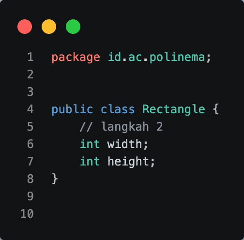

2. **Kode Main.java**  
   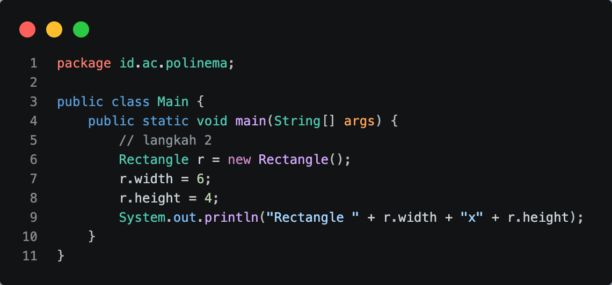

3. **Hasil Output**  
   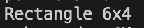

---

## Langkah 3: Menambahkan method (perilaku)

1. **Kode Rectangle.java**  
   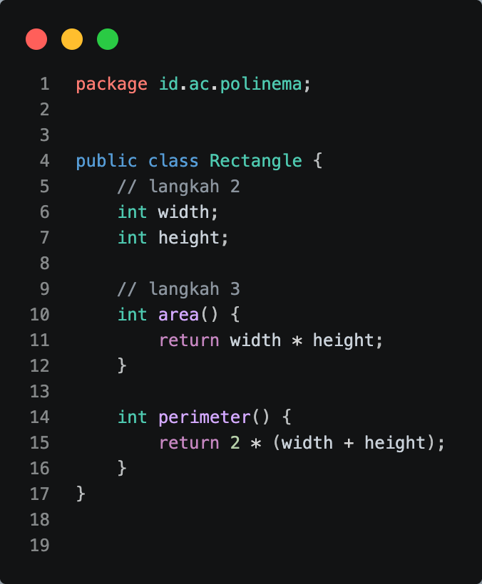

2. **Kode Main.java**  
   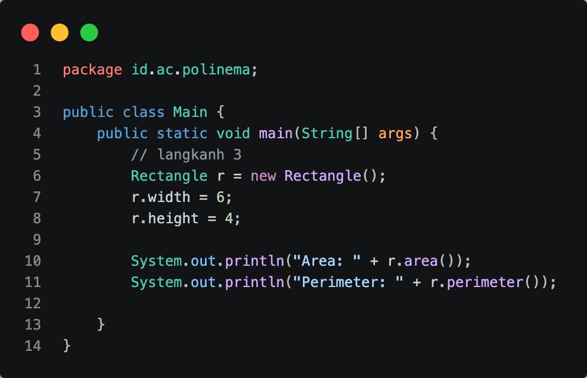

3. **Hasil Output**  
   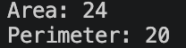

---

## Langkah 4: Konstruktor dan this

1. **Kode Rectangle.java**  
   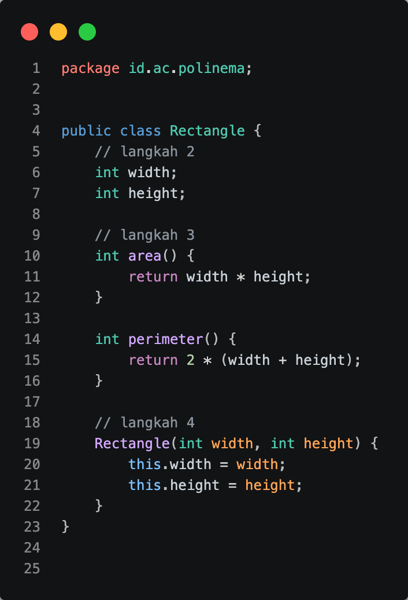

2. **Kode Main.java**  
   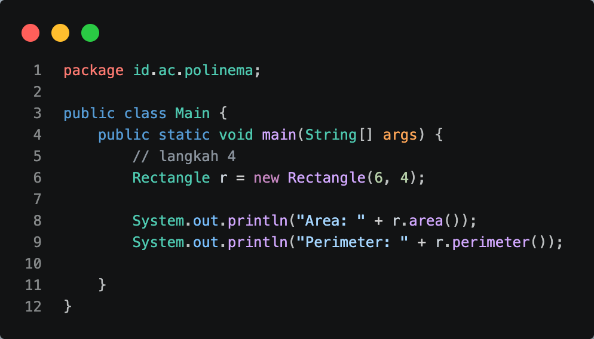

3. **Hasil Output**  
   

---

## Langkah 5: Referensi, aliasing, dan null

1. **Kode Main.java**  
   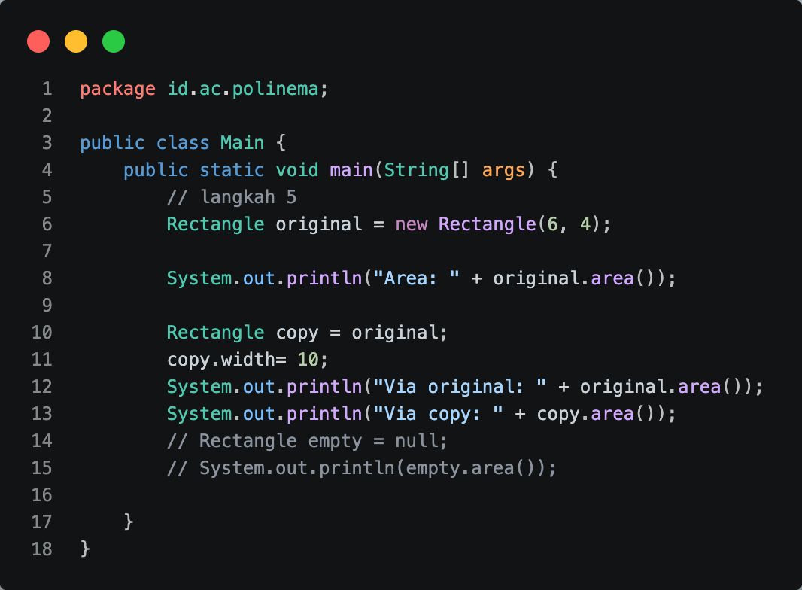

2. **Hasil Output**  
   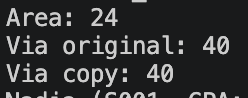

---

## Langkah 6: Kelas Student dari diagram UML

1. **Kode Student.java**  
   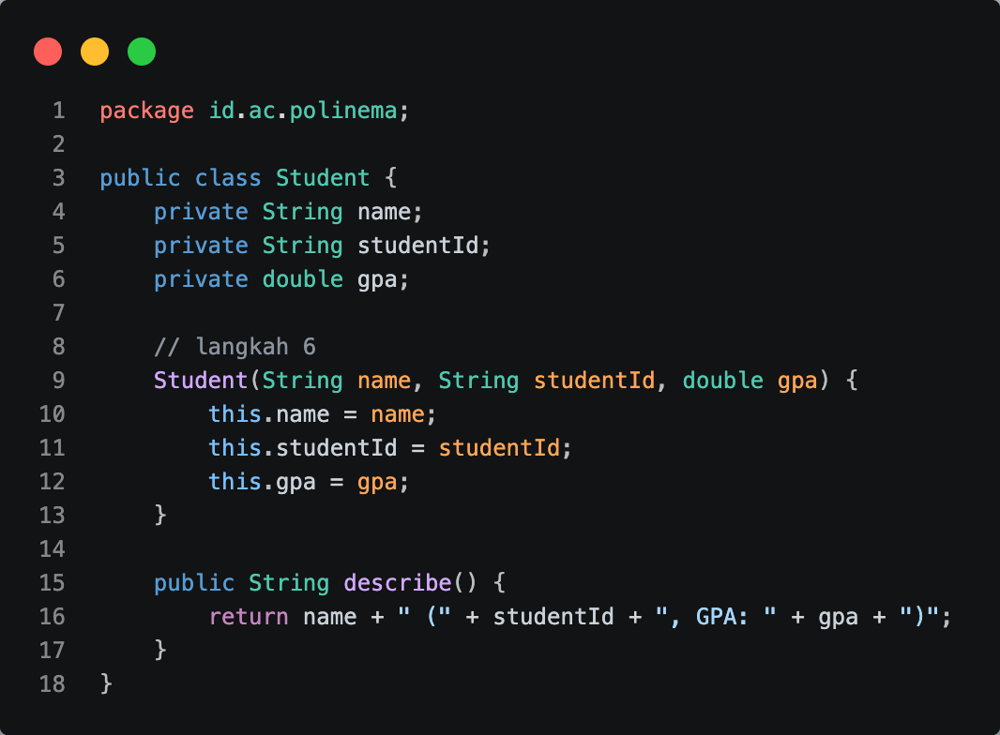

2. **Kode Main.java**  
   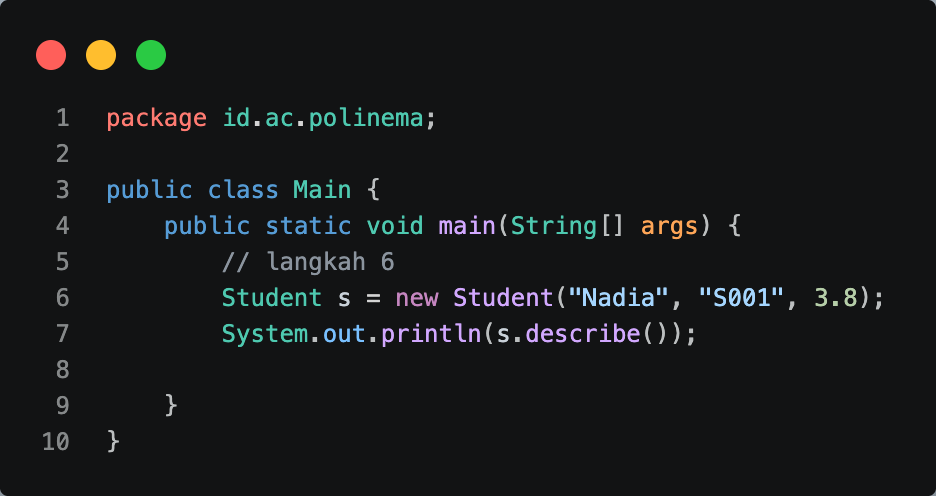

3. **Hasil Output**  
   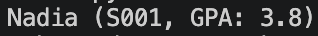

---

## Langkah 7: Array of objects, banyak objek dari satu kelas

1. **Kode Main.java**  
   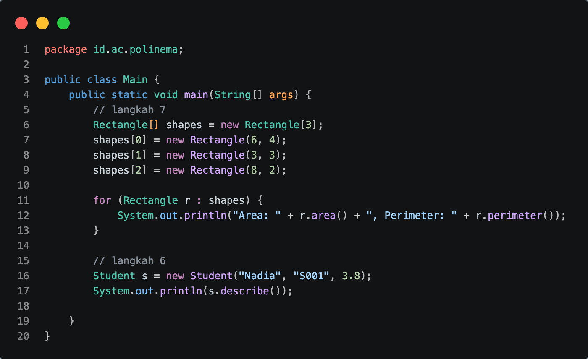

2. **Hasil Output**  
   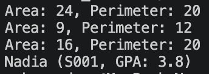

---

## Tugas Mandiri

1. **Kode Circle.java**  
   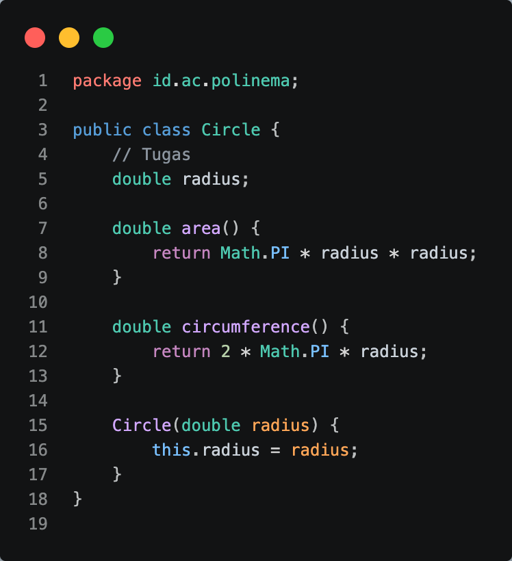

2. **Kode Main.java**  
   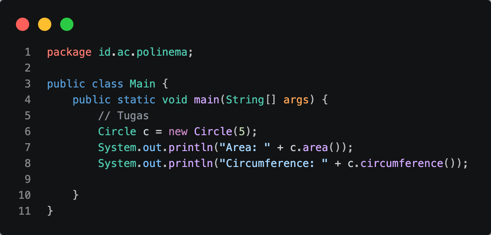

3. **Hasil Output**  
   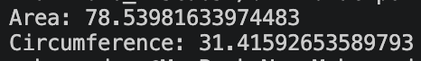

4. **Pertanyaan Konsep**  
   - **(a) 
     Objek adalah wujud nyata data yang disimpan di dalam memori, sedangkan referensi objek hanyalah variabel penampung yang berisi alamat untuk menunjuk ke objek tersebut.** 
   - **(b) 
     Konstruktor dijalankan secara otomatis tepat pada saat sebuah objek baru dibuat menggunakan kata kunci `new`.**

