# Laporan Praktikum PrakPBO

- **Nama:** Muhammad Nur Rochman
- **NIM:** 254107020121
- **Kelas:** TI-2G

---

## Percobaan 1

1. **Kode Motor.java**  
   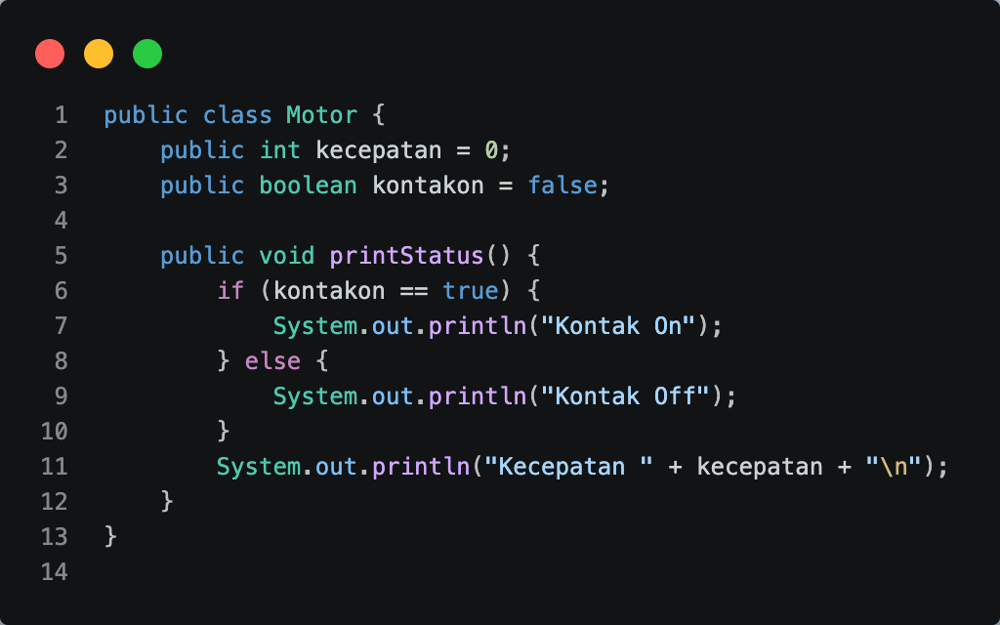

2. **Kode MotorDemo.java**  
   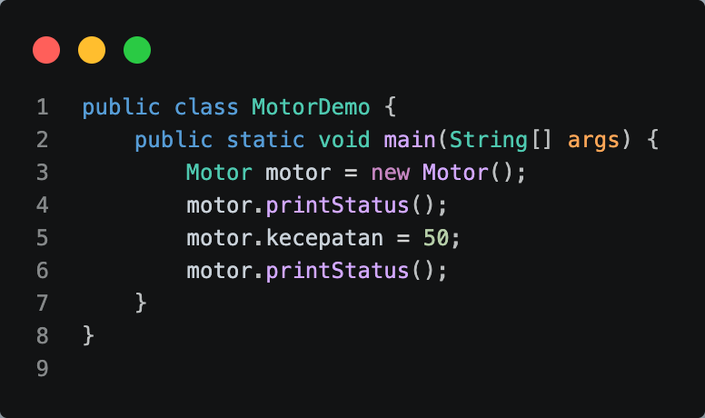

3. **Hasil Output**  
   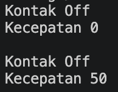

---

## Percobaan 2

1. **Kode Motor.java**  
   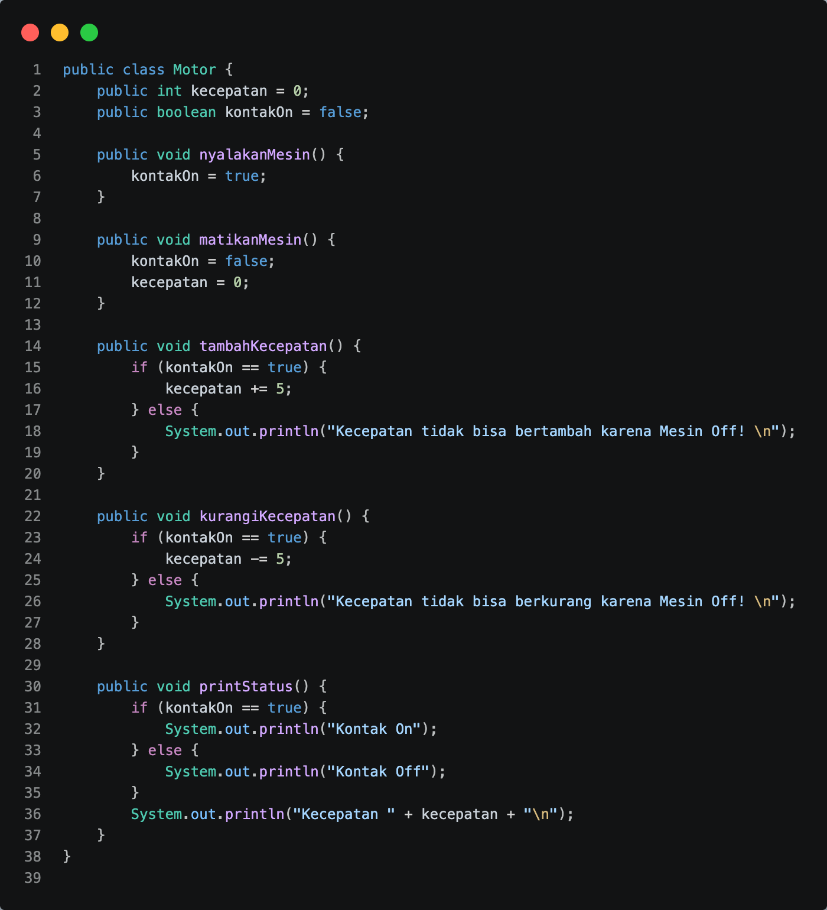

2. **Kode MotorDemo.java**  
   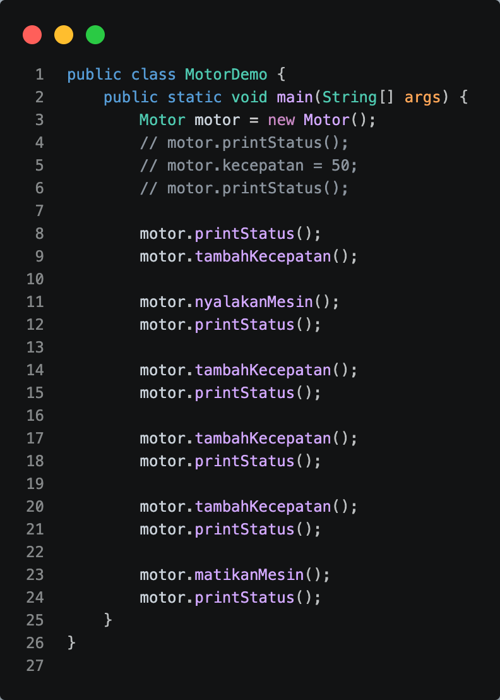

3. **Hasil Output**  
   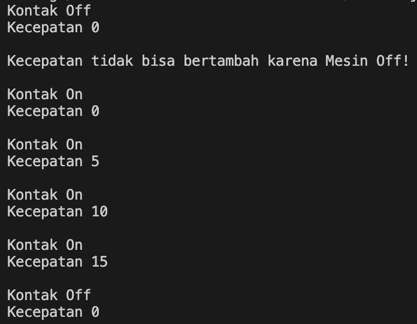

### Pertanyaan

1. **Karena terdapat pengkondisian `if (kontakon == true)` di dalam method `tambahKecepatan()`. Saat pertama kali      dipanggil, status `kontakOn` masih `false` sehingga blok `else` yang mencetak notifikasi tersebut dieksekusi.**

2. **Agar menerapkan konsep enkapsulasi (*information hiding*) sehingga nilai atribut tidak dapat diubah secara langsung dari luar kelas, melainkan harus melalui method terkontrol.**

3. **Berikut Kodenya**  
   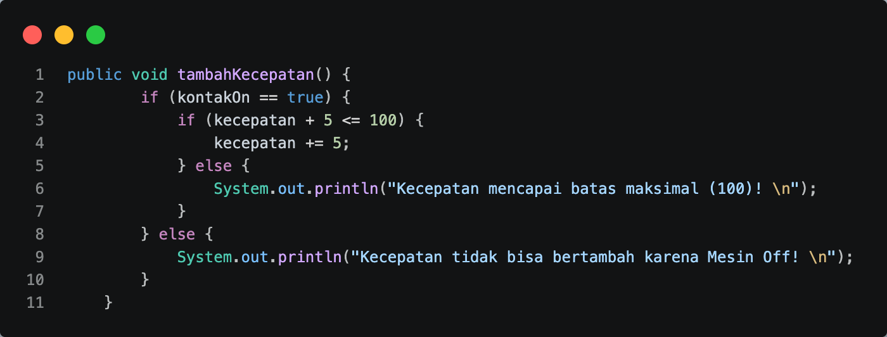

---

## Percobaan 3

1. **Kode Anggota.java**  
   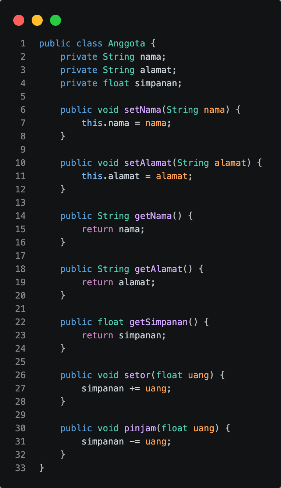

2. **Kode KoperasiDemo.java**  
   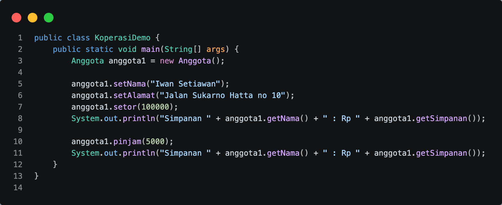

3. **Hasil Output**  
   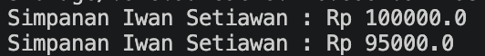

---

## Percobaan 4

1. **Kode Anggota.java**  
   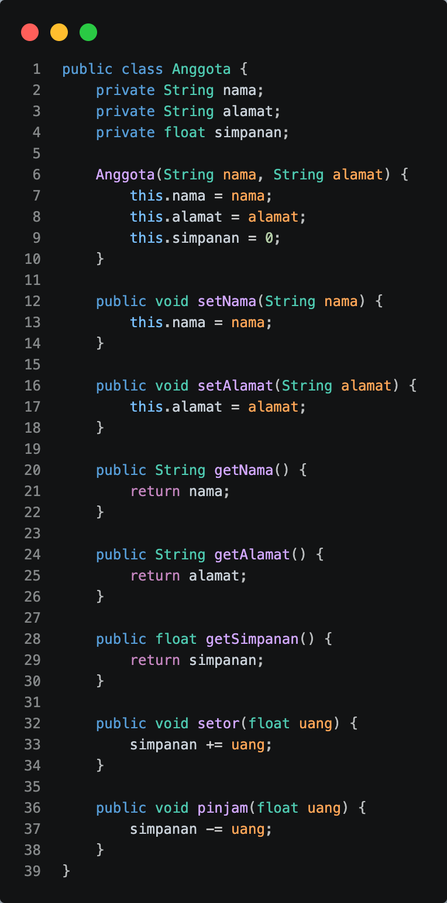

2. **Kode KoperasiDemo.java**  
   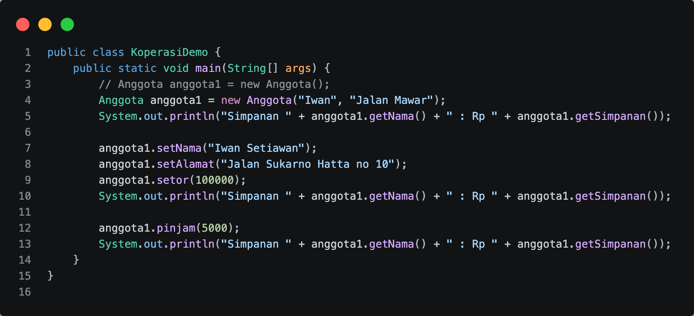

3. **Hasil Output**  
   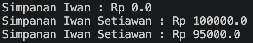

### Pertanyaan

1. **Getter adalah method `public` ber-return type untuk membaca nilai atribut `private`, sedangkan setter adalah method `public` bertipe `void` untuk memberi/mengubah nilai atribut `private`.**

2. **Untuk mengambil atau menampilkan nilai saldo dari atribut `simpanan`.**

3. **Method `setor(float uang)`.**  

4. **Method khusus yang dipanggil otomatis saat instansiasi objek (`new`), memiliki nama persis sama dengan kelas, dan tidak memiliki tipe return.**  

5. **Nama harus sama dengan kelas, tidak memilik return type (bahkan tanpa `void`), dan tidak boleh menggunakan modifier `abstract`, `static`, `final`, atau `synchronized`.**  
 
6. **Boleh, biasanya digunakan pada *Singleton Pattern* atau *Utility Class*.**  

7. **Saat objek membutuhkan inisialisasi nilai awal spesifik pada saat pembuatan objek.**  

8. **Inisialisasi atribut adalah pemberian nilai awal pada atribut, sedangkan instansiasi atribut adalah alokasi memori dan pembuatan objek baru menggunakan kata kunci `new`.**  

9. **Inisialisasi method adalah penulisan blok kode dan logika method di dalam kelas, sedangkan pemanggilan/eksekusi method adalah proses menjalankan method melalui objek yang sudah dibuat.**  

---

## Tugas

*(Tambahkan sub-bab tugas 1-7 di sini jika sudah kamu kerjakan)*

# Laporan Praktikum PrakPBO

- **Nama:** Muhammad Nur Rochman
- **NIM:** 254107020121
- **Kelas:** TI-2G

---

## Percobaan 1

1. **Kode Motor.java**  
   

2. **Kode MotorDemo.java**  
   

3. **Hasil Output**  
   

---

## Percobaan 2

1. **Kode Motor.java**  
   

2. **Kode MotorDemo.java**  
   

3. **Hasil Output**  
   

### Pertanyaan

1. **Karena terdapat pengkondisian `if (kontakon == true)` di dalam method `tambahKecepatan()`. Saat pertama kali dipanggil, status `kontakOn` masih `false` sehingga blok `else` yang mencetak notifikasi tersebut dieksekusi.**[cite: 1]

2. **Agar menerapkan konsep enkapsulasi (*information hiding*) sehingga nilai atribut tidak dapat diubah secara langsung dari luar kelas, melainkan harus melalui method terkontrol.**[cite: 1]

3. **Berikut Kodenya**  
   

---

## Percobaan 3

1. **Kode Anggota.java**  
   

2. **Kode KoperasiDemo.java**  
   

3. **Hasil Output**  
   

---

## Percobaan 4

1. **Kode Anggota.java**  
   

2. **Kode KoperasiDemo.java**  
   

3. **Hasil Output**  
   

### Pertanyaan

1. **Getter adalah method `public` ber-return type untuk membaca nilai atribut `private`, sedangkan setter adalah method `public` bertipe `void` untuk memberi/mengubah nilai atribut `private`.**[cite: 1]

2. **Untuk mengambil atau menampilkan nilai saldo dari atribut `simpanan`.**[cite: 1]

3. **Method `setor(float uang)`.**[cite: 1]

4. **Method khusus yang dipanggil otomatis saat instansiasi objek (`new`), memiliki nama persis sama dengan kelas, dan tidak memiliki tipe return.**[cite: 1]

5. **Nama harus sama dengan kelas, tidak memilik return type (bahkan tanpa `void`), dan tidak boleh menggunakan modifier `abstract`, `static`, `final`, atau `synchronized`.**[cite: 1]

6. **Boleh, biasanya digunakan pada *Singleton Pattern* atau *Utility Class*.**[cite: 1]

7. **Saat objek membutuhkan inisialisasi nilai awal spesifik pada saat pembuatan objek.**[cite: 1]

8. **Inisialisasi atribut adalah pemberian nilai awal pada atribut, sedangkan instansiasi atribut adalah alokasi memori dan pembuatan objek baru menggunakan kata kunci `new`.**

9. **Inisialisasi method adalah penulisan blok kode dan logika method di dalam kelas, sedangkan pemanggilan/eksekusi method adalah proses menjalankan method melalui objek yang sudah dibuat.**

---

## Tugas

### Tugas 1
1. **Kode EncapDemo.java**  
   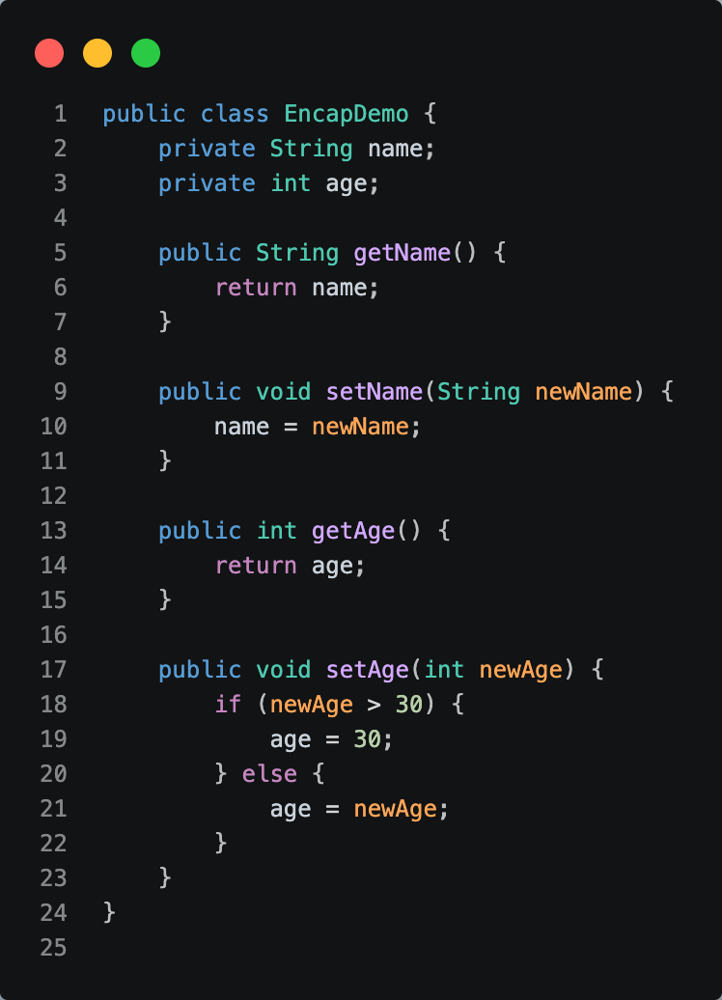

2. **Kode EncapTest.java**  
   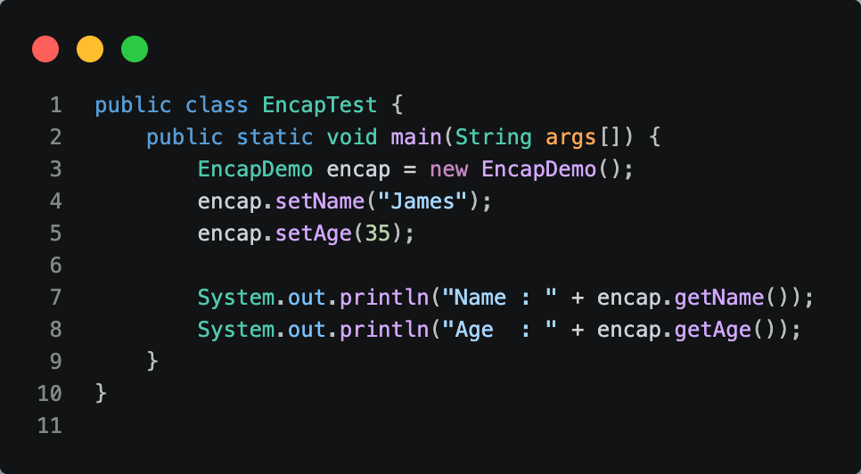

3. **Hasil Output**  
   

---

### Tugas 2
Pada saat `encap.setAge(35)` dipanggil, method `setAge` menjalankan pengkondisian `if (newAge > 30)`. Karena `35 > 30` bernilai `true`, nilai `age` diset ke batas maksimalnya yaitu `30`. Oleh karena itu, saat dipanggil `getAge()`, output yang tampil adalah `30`.

---

### Tugas 3
1. **Kode EncapTest.java (Modifikasi)**  
   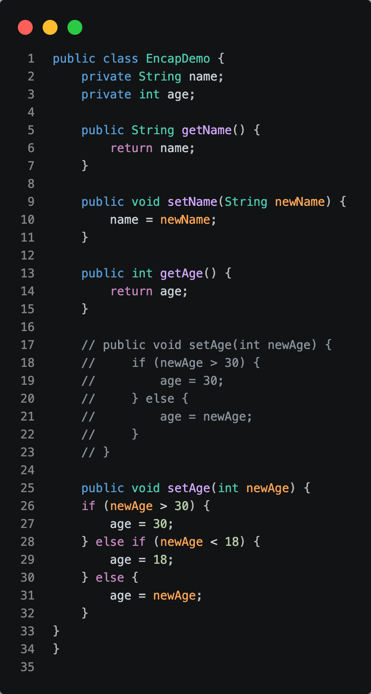

---

### Tugas 4
1. **Kode Kontainer.java**  
   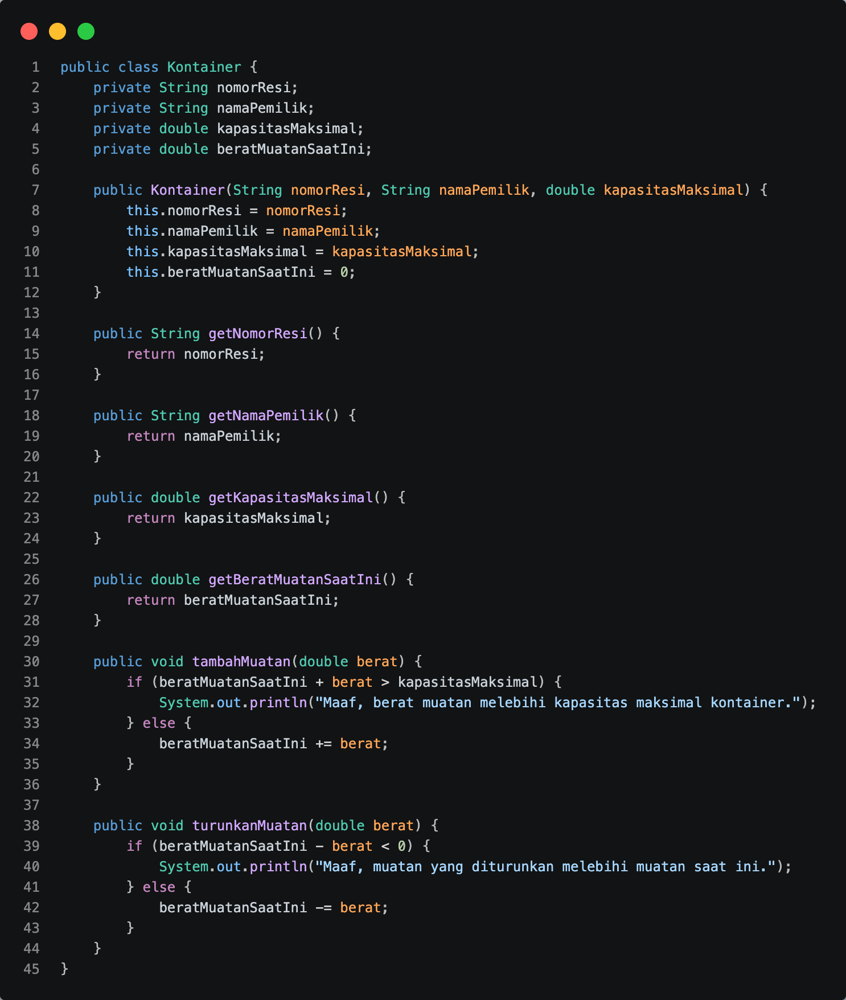

2. **Kode TestLogistik.java**  
   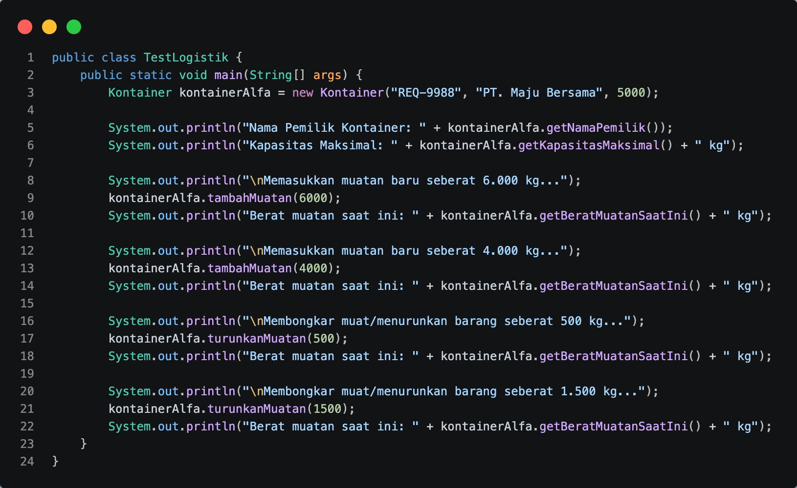

---

### Tugas 5
1. **Kode Kontainer.java (Modifikasi Pembongkaran 50%)**  
   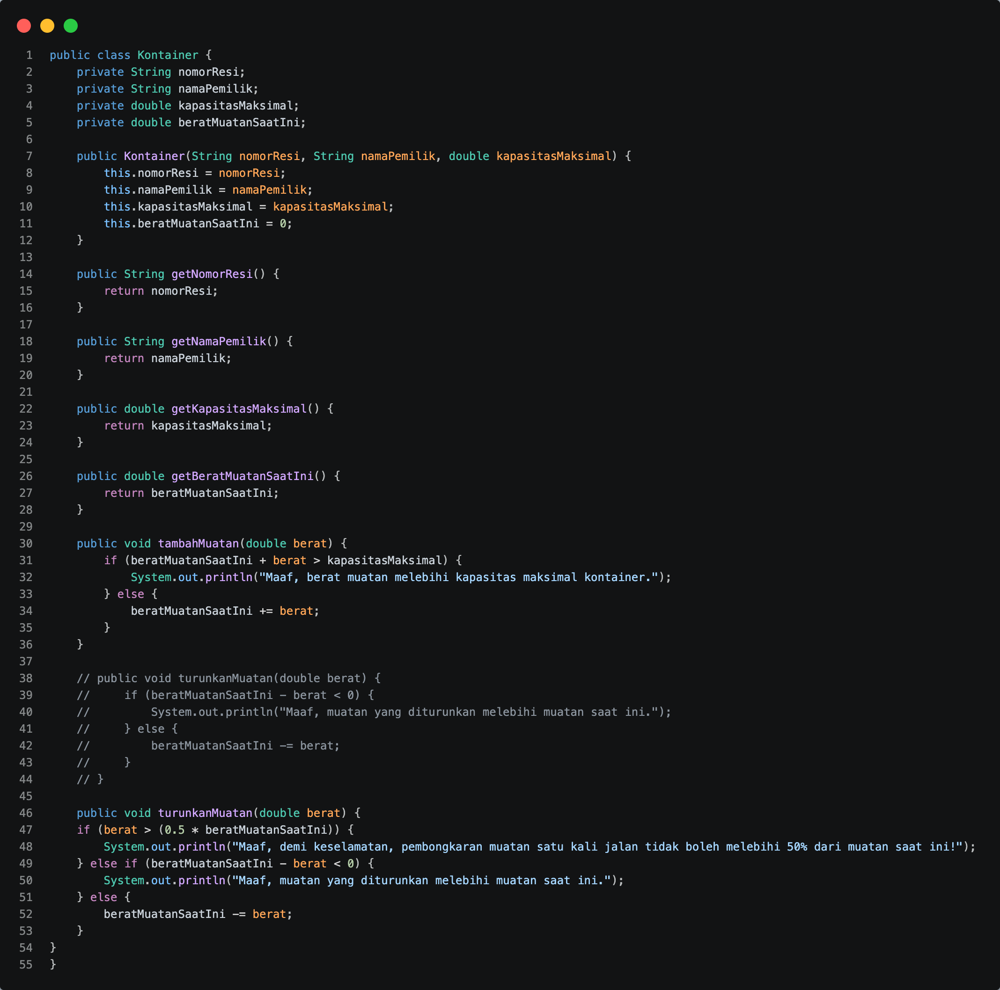

---

### Tugas 6
1. **Kode TestLogistik.java (Scanner Interaktif)**  
   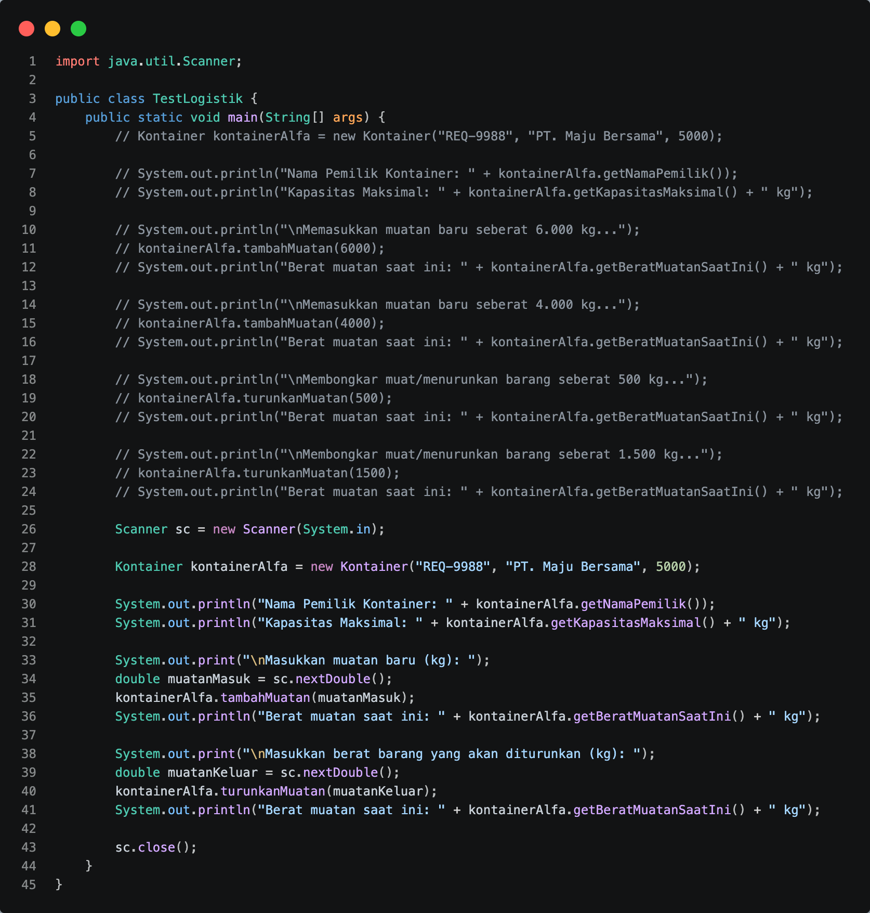

2. **Hasil Output**  
   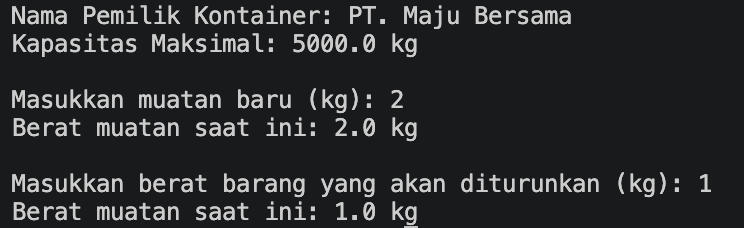

---

### Tugas 7
1. **Kode Tiket.java**  
   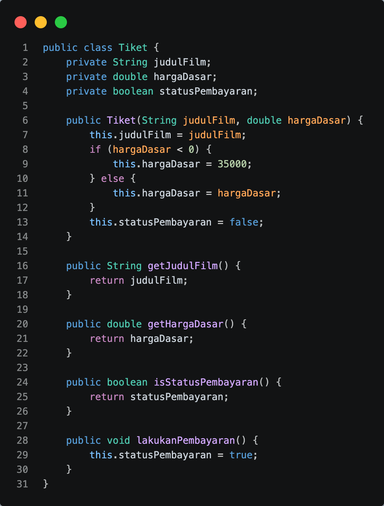

2. **Kode TestBioskop.java**  
   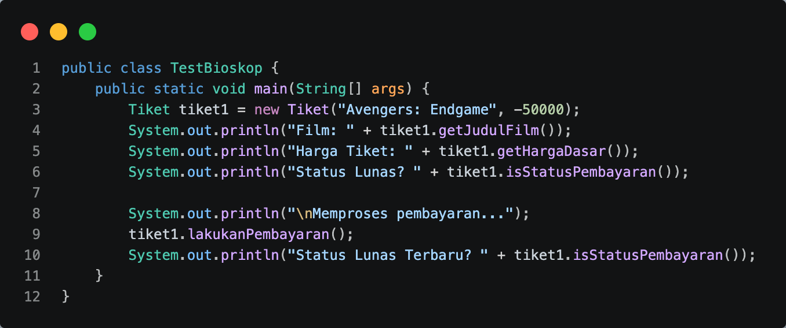

3. **Hasil Output**  
   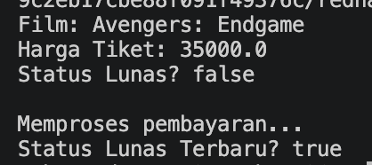