# Laporan Praktikum PrakPBO

- **Nama:** Muhammad Nur Rochman
- **NIM:** 254107020121
- **Kelas:** TI-2G

---

## Percobaan 1: Aggregation Satu ke Satu

### Implementasi Program

**Kelas Laptop**

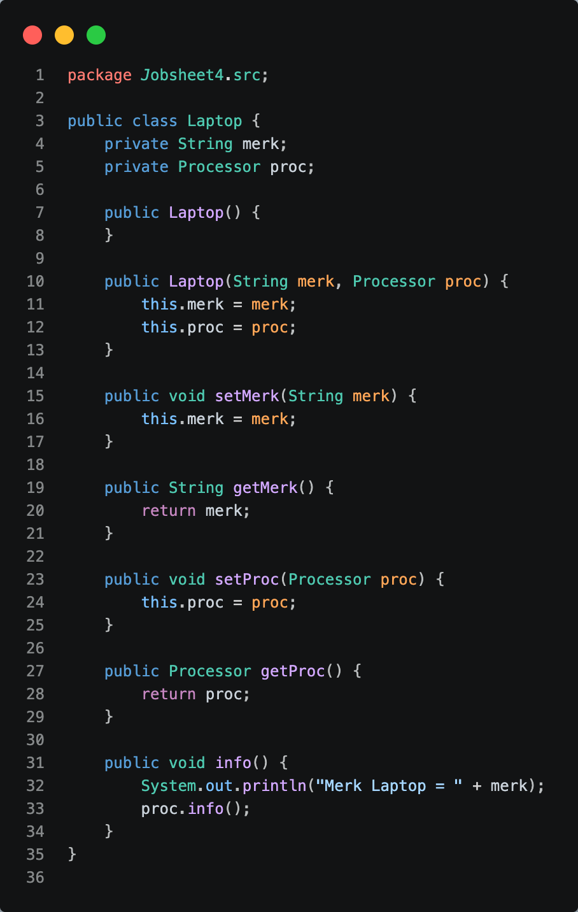

**Kelas Processor**

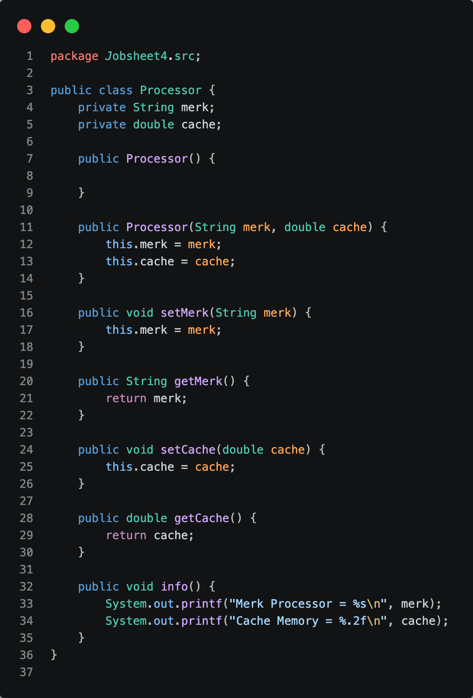

**Kelas MainPercobaan1**

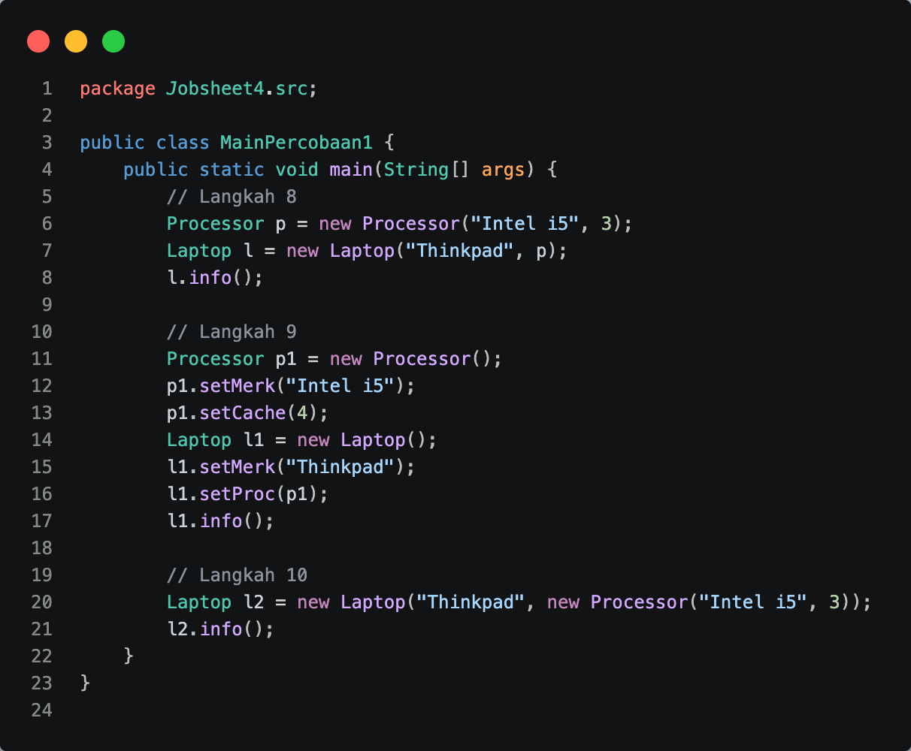

### Hasil Percobaan

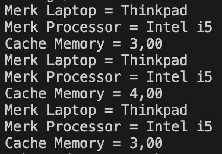

### Pertanyaan dan Jawaban Percobaan 1

**1. Apakah kegunaan method setter dan getter?**

Setter digunakan untuk mengisi atau mengubah nilai atribut, sedangkan getter digunakan untuk mengambil atau membaca nilai atribut.

**2. Apa perbedaan konstruktor default dan konstruktor berparameter?**

Konstruktor default tidak menerima parameter, sedangkan konstruktor berparameter menerima argumen untuk mengisi atribut objek saat objek dibuat.

**3. Atribut manakah pada kelas Laptop yang bertipe objek? Baris kode manakah yang menunjukkan relasi dengan Processor?**

Atribut `proc` bertipe objek `Processor`. Relasi ditunjukkan oleh deklarasi `private Processor proc;` pada kelas `Laptop`.

**4. Apakah kegunaan sintaks `proc.info()`?**

Sintaks tersebut memanggil method `info()` milik objek `Processor` yang tersimpan dalam atribut `proc`, sehingga informasi processor dapat ditampilkan.

**5. Apakah Langkah 8 dan Langkah 10 menghasilkan output berbeda? Mengapa?**

Tidak. Keduanya menghasilkan informasi yang sama karena menggunakan objek `Processor` dengan nilai yang sama. Perbedaannya hanya pada cara penulisan objek, yaitu menggunakan variabel atau membuat objek langsung di dalam argumen constructor.

**6. Apakah relasi Laptop–Processor termasuk Aggregation atau Composition? Apa buktinya?**

Relasi tersebut termasuk Aggregation karena objek `Processor` dibuat di luar kelas `Laptop`, kemudian diberikan melalui constructor atau setter. Buktinya adalah constructor yang menerima parameter `Processor` dan method `setProc(Processor proc)`.

**7. Jika Processor dibuat langsung di dalam constructor Laptop, apakah relasinya masih Aggregation?**

Jika objek `Processor` dibuat dan dimiliki langsung oleh `Laptop` melalui `new Processor(...)`, relasinya menunjukkan Composition karena objek bagian dibuat oleh kelas utama.

---

## Percobaan 2: Aggregation dengan Beberapa Relasi

### Implementasi Program

**Kelas Mobil**

**Kelas Pelanggan**

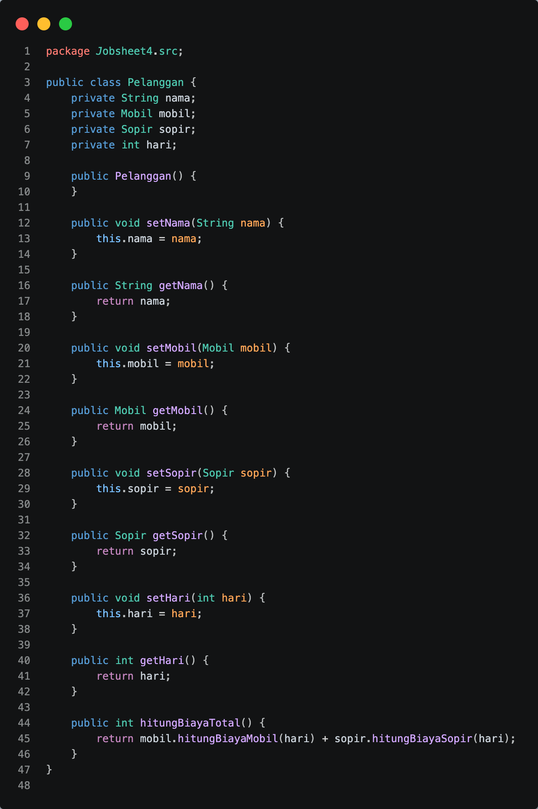

**Kelas Sopir**

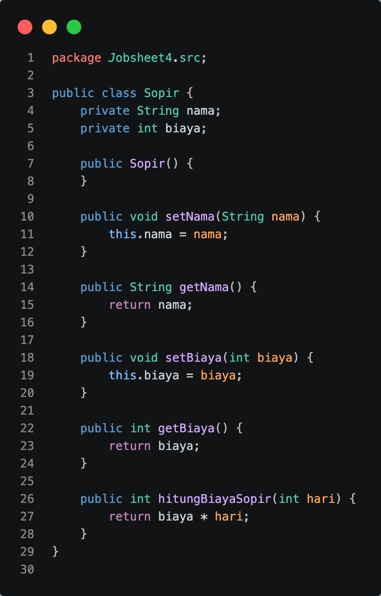

**Kelas MainPercobaan2**

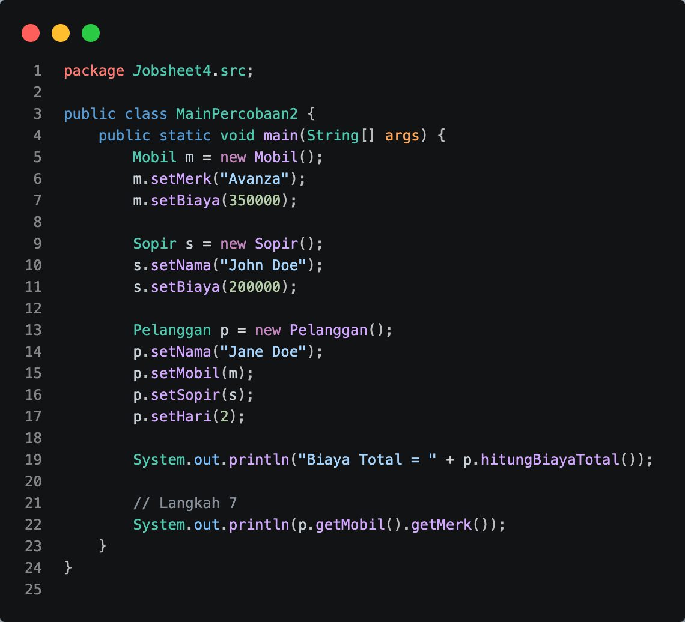

### Hasil Percobaan

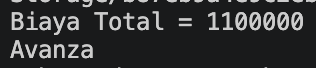

Program menghitung biaya mobil dan biaya sopir selama dua hari, lalu menjumlahkannya menjadi biaya total. Program juga menampilkan merek mobil yang terhubung dengan pelanggan.

### Pertanyaan dan Jawaban Percobaan 2

**1. Baris program manakah yang menunjukkan relasi Pelanggan dengan Mobil dan Sopir?**

Relasi ditunjukkan oleh deklarasi atribut `private Mobil mobil;` dan `private Sopir sopir;` pada kelas `Pelanggan`. Kedua atribut tersebut menyimpan referensi objek dari kelas `Mobil` dan `Sopir`.

**2. Mengapa method biaya mobil dan sopir memiliki argumen `hari`?**

Argumen `hari` digunakan untuk menentukan lama penyewaan sehingga biaya dapat dihitung berdasarkan jumlah hari. Nilainya dikirim dari objek `Pelanggan` ke method milik `Mobil` dan `Sopir`.

**3. Apa kegunaan `mobil.hitungBiayaMobil(hari)` dan `sopir.hitungBiayaSopir(hari)`?**

Kedua pemanggilan tersebut digunakan untuk menghitung biaya sewa mobil dan biaya sopir berdasarkan jumlah hari. Hasilnya kemudian dijumlahkan untuk memperoleh biaya total.

**4. Apa kegunaan `p.setMobil(m)` dan `p.setSopir(s)`?**

Kedua perintah tersebut menghubungkan objek `Mobil` dan `Sopir` dengan objek `Pelanggan` melalui setter, sehingga atribut `mobil` dan `sopir` memiliki referensi objek yang dapat digunakan.

**5. Apa kegunaan `p.hitungBiayaTotal()`?**

Method tersebut digunakan untuk menghitung total biaya sewa mobil dan sopir berdasarkan jumlah hari penyewaan.

**6. Jelaskan urutan eksekusi `p.getMobil().getMerk()`.**

Pertama, `p.getMobil()` mengembalikan objek `Mobil` yang tersimpan pada atribut `mobil` milik `Pelanggan`. Selanjutnya, `getMerk()` dipanggil pada objek `Mobil` tersebut untuk mengambil merek mobil.

**7. Apa yang terjadi jika `p.setMobil(m)` tidak dipanggil sebelum `p.hitungBiayaTotal()` dijalankan?**

Program akan mengalami `NullPointerException` karena atribut `mobil` pada objek `Pelanggan` masih bernilai `null`. Ketika method memanggil method milik objek `mobil`, Java tidak dapat menjalankannya karena belum ada referensi objek yang valid.

---

## Percobaan 3: Aggregation dengan Dua Peran pada Kelas yang Sama

### Implementasi Program

**Kelas KeretaApi**

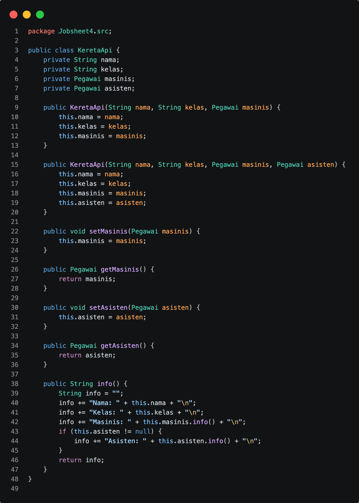

**Kelas Pegawai**

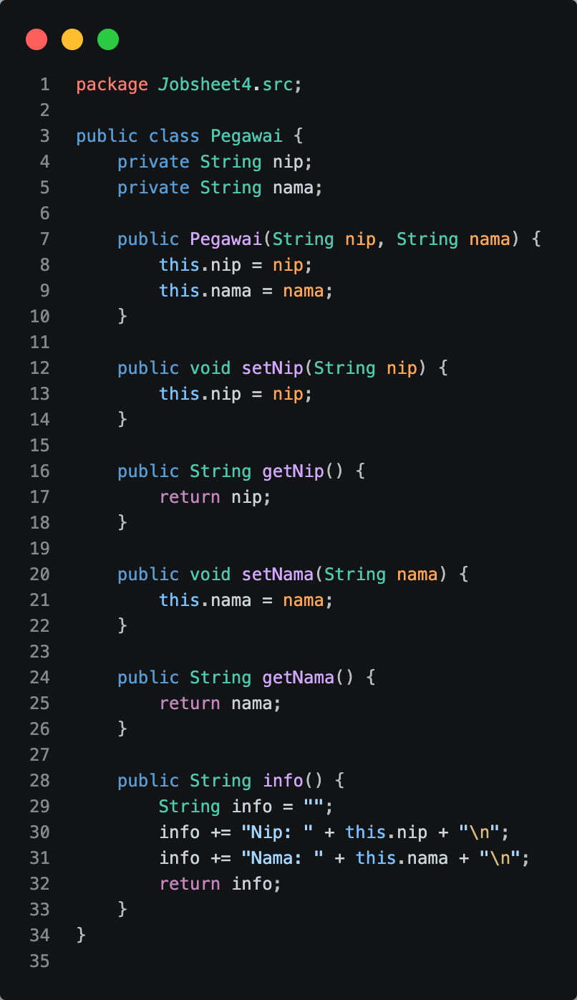

**Kelas MainPercobaan3**

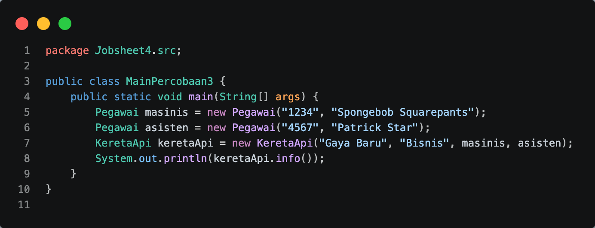

### Hasil Percobaan

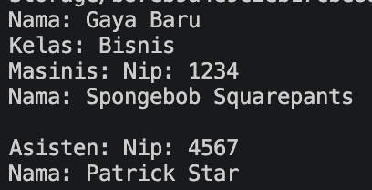

### Pertanyaan dan Jawaban Percobaan 3

**1. Apa kegunaan `this.masinis.info()` dan `this.asisten.info()`?**

Kedua sintaks tersebut memanggil method `info()` milik objek `Pegawai` yang berperan sebagai masinis dan asisten. Informasinya digunakan untuk menyusun informasi kereta api.

**2. Apa yang terjadi sebelum program diperbaiki dengan guard clause?**

Program mengalami `NullPointerException` ketika menjalankan `this.asisten.info()` karena objek asisten belum diberikan. Akibatnya, program berhenti sebelum seluruh informasi kereta ditampilkan.

**3. Apa isi variabel `asisten` pada constructor tiga parameter sebelum guard clause ditambahkan?**

Atribut `asisten` bernilai `null` karena constructor tiga parameter hanya menerima nama kereta, kelas kereta, dan objek masinis. Tidak ada objek asisten yang diberikan.

**4. Apakah objek masinis juga perlu diperiksa dengan guard clause?**

Pada kode jobsheet, objek masinis tidak perlu diperiksa dengan cara yang sama karena constructor menerima parameter masinis dan mengisinya ke atribut `masinis`. Namun, jika nilai `null` diberikan sebagai argumen masinis, pemeriksaan tambahan diperlukan agar tidak terjadi `NullPointerException`.

**5. Apa manfaat guard clause pada atribut asisten?**

Guard clause memastikan method `info()` milik asisten hanya dipanggil ketika atribut `asisten` tidak bernilai `null`. Dengan demikian, program tetap dapat menampilkan informasi kereta meskipun belum memiliki asisten.

---

## Percobaan 4: Aggregation dengan Array Objek

### Implementasi Program

**Kelas Gerbong**

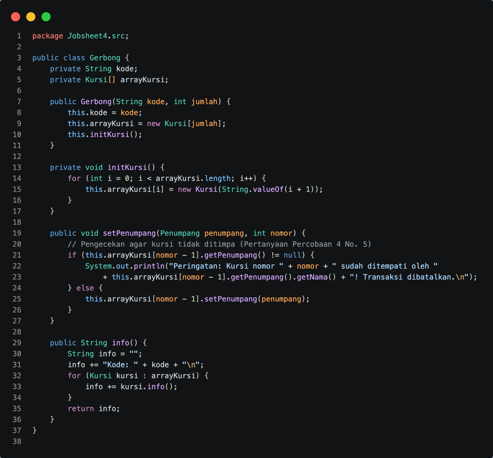

**Kelas Kursi**

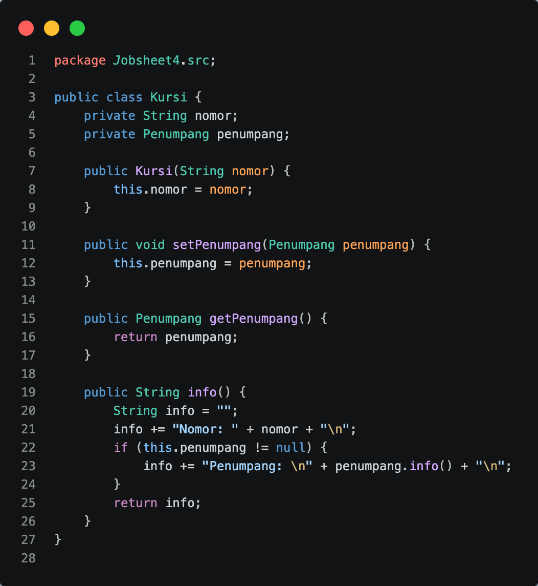

**Kelas MainPercobaan4**

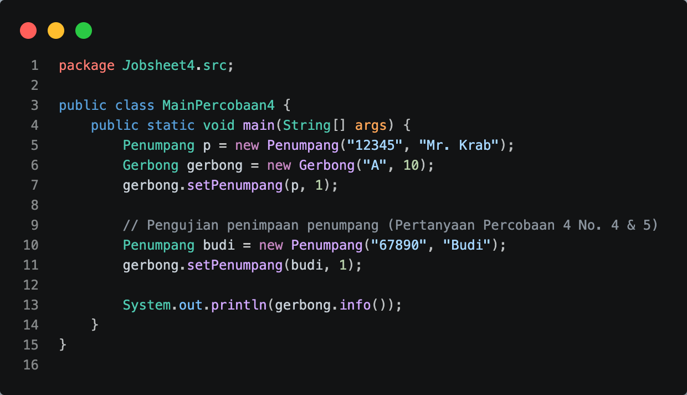

**Kelas Penumpang**

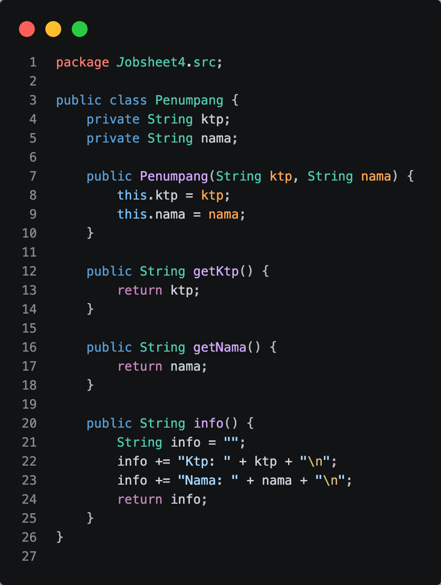

### Hasil Percobaan

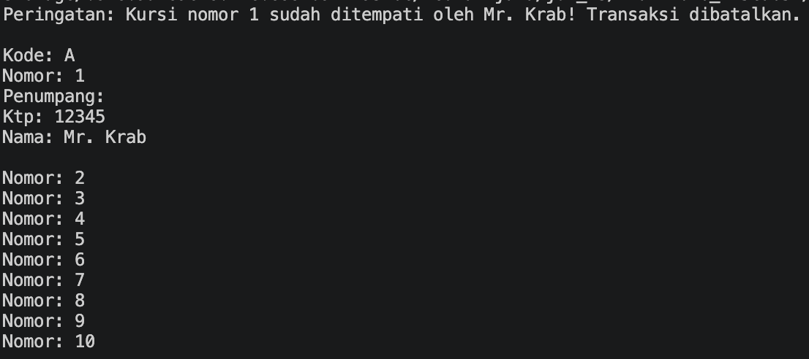

### Pertanyaan dan Jawaban Percobaan 4

**1. Berapakah jumlah kursi dalam Gerbong A pada program utama?**

Jumlah kursi dalam Gerbong A adalah 10 kursi, sesuai dengan kode `new Gerbong("A", 10);`.

**2. Apa maksud kode `if (this.penumpang != null)` pada method `info()` kelas Kursi?**

Kode tersebut memeriksa apakah kursi sudah memiliki penumpang. Jika atribut `penumpang` tidak bernilai `null`, informasi penumpang ditampilkan. Jika masih `null`, informasi penumpang tidak ditampilkan.

**3. Mengapa nomor kursi dikurangi 1 pada method `setPenumpang()`?**

Nomor kursi yang digunakan pengguna dimulai dari 1, sedangkan indeks array Java dimulai dari 0. Karena itu, `nomor - 1` digunakan agar kursi nomor 1 mengakses indeks array 0.

**4. Apa yang terjadi jika objek Budi dimasukkan ke kursi nomor 1 yang sudah ditempati Mr. Krab? Apakah Java memberikan peringatan atau error?**

Jika hanya menggunakan setter biasa, referensi penumpang pada kursi tersebut akan diganti dengan objek Budi. Java tidak otomatis memberikan peringatan atau error karena penggantian referensi diperbolehkan. Karena itu, diperlukan pemeriksaan agar kursi yang sudah terisi tidak ditimpa.

**5. Apa perbedaan relasi Gerbong–Kursi dan Kursi–Penumpang?**

Relasi Gerbong–Kursi merupakan Composition karena objek `Kursi` dibuat langsung oleh kelas `Gerbong` dan disimpan dalam array. Relasi Kursi–Penumpang merupakan Aggregation karena objek `Penumpang` dibuat secara terpisah dan diberikan kepada kursi.

---

## Percobaan 5: Composition

### Implementasi Program

**Kelas Mobilp5**

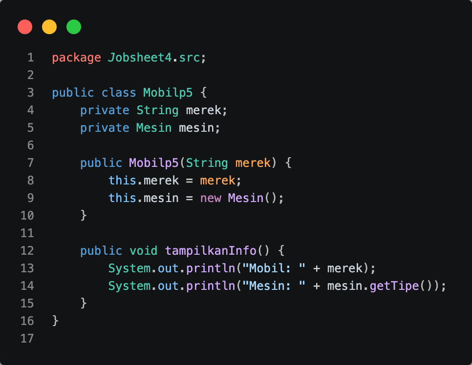

**Kelas Mesin**

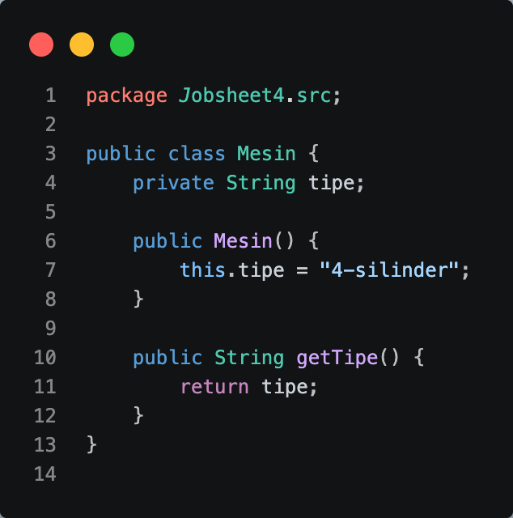

**Kelas MainPercobaan5**

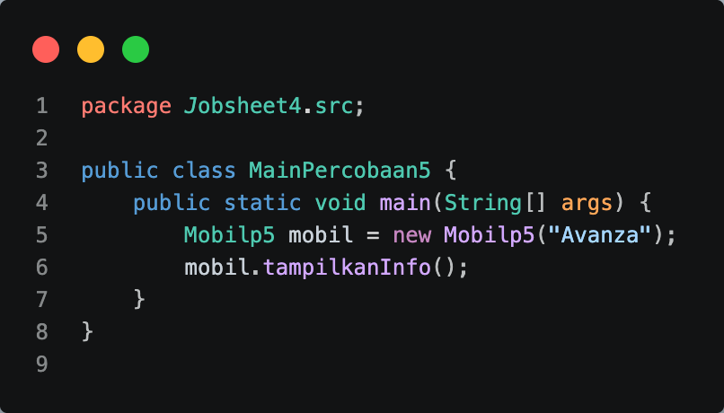

### Hasil Percobaan

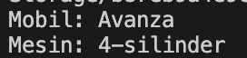

### Pertanyaan dan Jawaban Percobaan 5

**1. Baris manakah yang menunjukkan bahwa Mesin dimiliki oleh Mobil?**

Baris `this.mesin = new Mesin();` pada constructor kelas `Mobilp5` menunjukkan bahwa objek `Mesin` dibuat langsung oleh `Mobilp5` dan disimpan sebagai bagiannya.

**2. Apa yang terjadi jika ditambahkan method `setMesin(Mesin mesin)`? Apakah relasinya tetap Composition?**

Setter memungkinkan objek `Mesin` dari luar diberikan atau menggantikan mesin yang dimiliki mobil. Jika mesin dibuat dan dikelola secara terpisah, hubungan tersebut lebih menunjukkan Aggregation karena objek bagian dapat berasal dari luar.

**3. Apa perbedaan kode yang membuat Laptop–Processor termasuk Aggregation dan Mobil–Mesin termasuk Composition?**

Pada Aggregation, objek `Processor` dibuat di luar kelas `Laptop`, lalu diberikan melalui constructor atau setter. Pada Composition, objek `Mesin` dibuat langsung di dalam constructor `Mobilp5` menggunakan `new Mesin()`.

**4. Apa yang terjadi pada objek Mesin jika variabel mobil diisi `null`? Bagaimana perbandingannya dengan Processor?**

Jika variabel yang menunjuk objek mobil diisi `null`, variabel tersebut tidak lagi dapat digunakan untuk mengakses objek `Mesin` melalui mobil. Jika tidak ada referensi lain yang dapat dijangkau, objek terkait dapat dibersihkan oleh garbage collector. Pada Aggregation, objek `Processor` masih dapat digunakan jika ada referensi lain yang menunjuk kepadanya.

**5. Jika constructor Mobil menerima objek Mesin sebagai parameter, apakah relasinya berubah menjadi Aggregation?**

Pola tersebut menunjukkan Aggregation apabila objek `Mesin` dibuat secara terpisah lalu diberikan melalui parameter constructor. Dengan begitu, objek mesin dapat dibuat dan digunakan secara terpisah dari objek mobil.

---

## Percobaan 6: Dependency

### Implementasi Program

**Kelas Laptopp6**

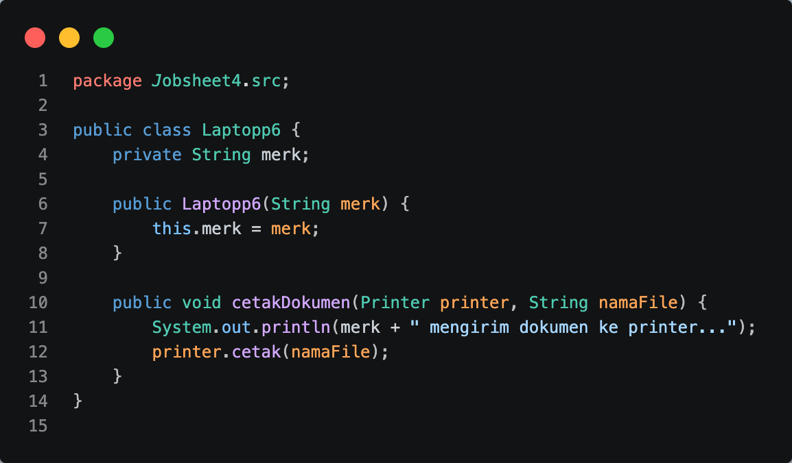

**Kelas Printer**

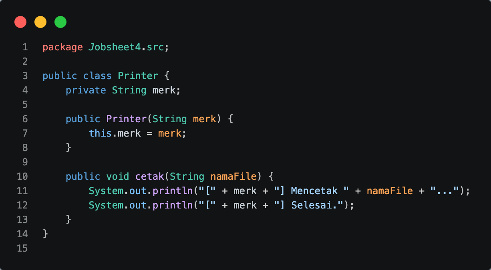

**Kelas MainPercobaan6**

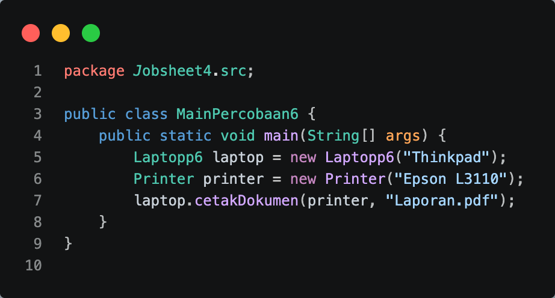

### Hasil Percobaan

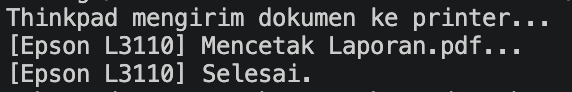

Program menampilkan proses laptop mengirim dokumen ke printer, kemudian printer mencetak file dan menampilkan pesan bahwa proses pencetakan selesai. Hubungan dependency terlihat dari objek `Printer` yang digunakan sebagai parameter metode `cetakDokumen()`.

### Pertanyaan dan Jawaban Percobaan 6

**1. Apakah kelas Laptop memiliki atribut bertipe Printer? Apa perbedaannya dengan Percobaan 1?**

Tidak. Pada Percobaan 6, objek `Printer` hanya digunakan sebagai parameter method `cetakDokumen()`. Berbeda dengan Percobaan 1, kelas `Laptop` menyimpan objek `Processor` sebagai atribut.

**2. Setelah method `cetakDokumen()` selesai, apakah Laptop masih menyimpan referensi ke Printer?**

Tidak. Kelas `Laptopp6` tidak menyimpan objek `Printer` sebagai atribut. Objek tersebut hanya digunakan selama pemanggilan method `cetakDokumen()` berlangsung.

**3. Mengapa relasi Laptop–Printer disebut Dependency, bukan Aggregation?**

Relasi tersebut disebut Dependency karena objek `Printer` hanya digunakan sementara sebagai parameter method dan tidak disimpan sebagai atribut kelas `Laptopp6`. Aggregation menyimpan referensi objek bagian sebagai atribut.

**4. Jika Printer disimpan sebagai atribut Laptop, apakah relasinya berubah menjadi Aggregation?**

Ya, jika atribut `Printer` diisi melalui constructor atau setter menggunakan objek yang dibuat secara terpisah, relasinya menjadi Aggregation. Kelas `Laptopp6` dapat menyimpan referensi objek `Printer` dan menggunakannya kembali.

**5. Apa perbedaan Aggregation, Composition, dan Dependency berdasarkan atribut dan pembuatan objek?**

- **Aggregation:** objek bagian disimpan sebagai atribut, tetapi dibuat secara terpisah dan diberikan kepada objek utama.
- **Composition:** objek bagian disimpan sebagai atribut dan dibuat langsung oleh objek utama.
- **Dependency:** objek yang digunakan tidak disimpan sebagai atribut, melainkan hanya digunakan sementara, misalnya sebagai parameter method.

---

## Tugas Mandiri: Sistem Peminjaman Buku

### Deskripsi Kasus

Program ini merupakan sistem sederhana untuk mencatat peminjaman buku di perpustakaan. Anggota melakukan peminjaman buku dengan lama peminjaman tertentu. Program menghitung biaya berdasarkan biaya sewa buku per hari, kemudian mencetak bukti peminjaman.

### Implementasi Program

**Kelas Anggota**

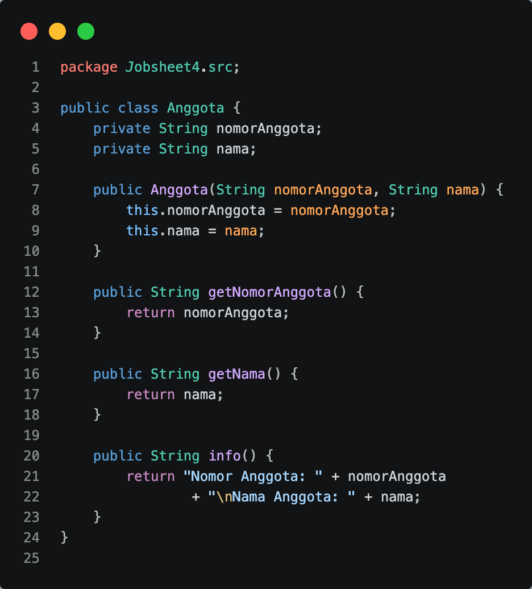

**Kelas Buku**

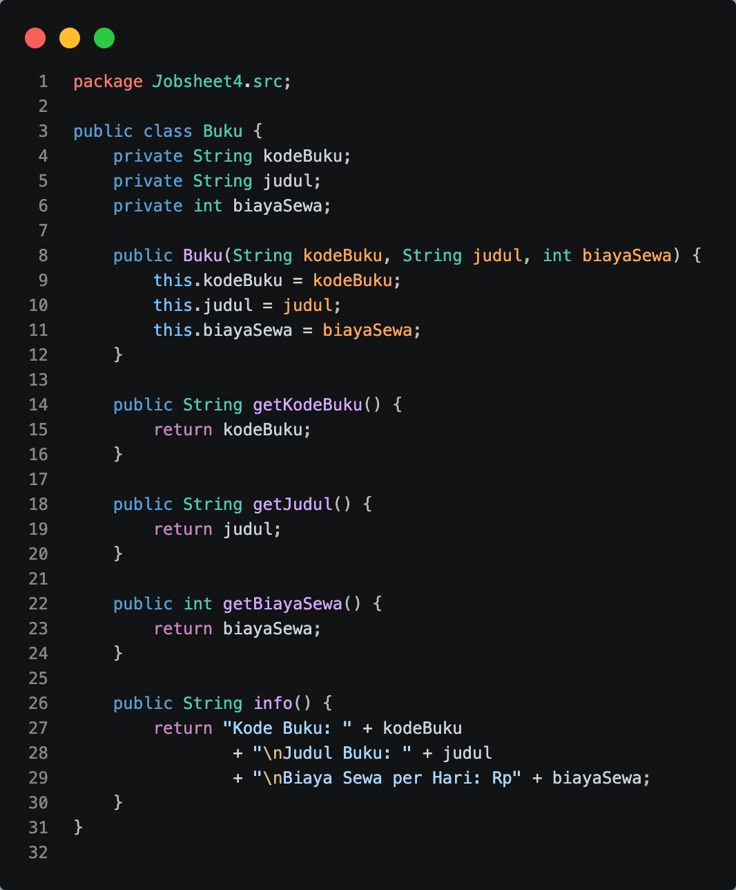

**Kelas DetailPeminjaman**

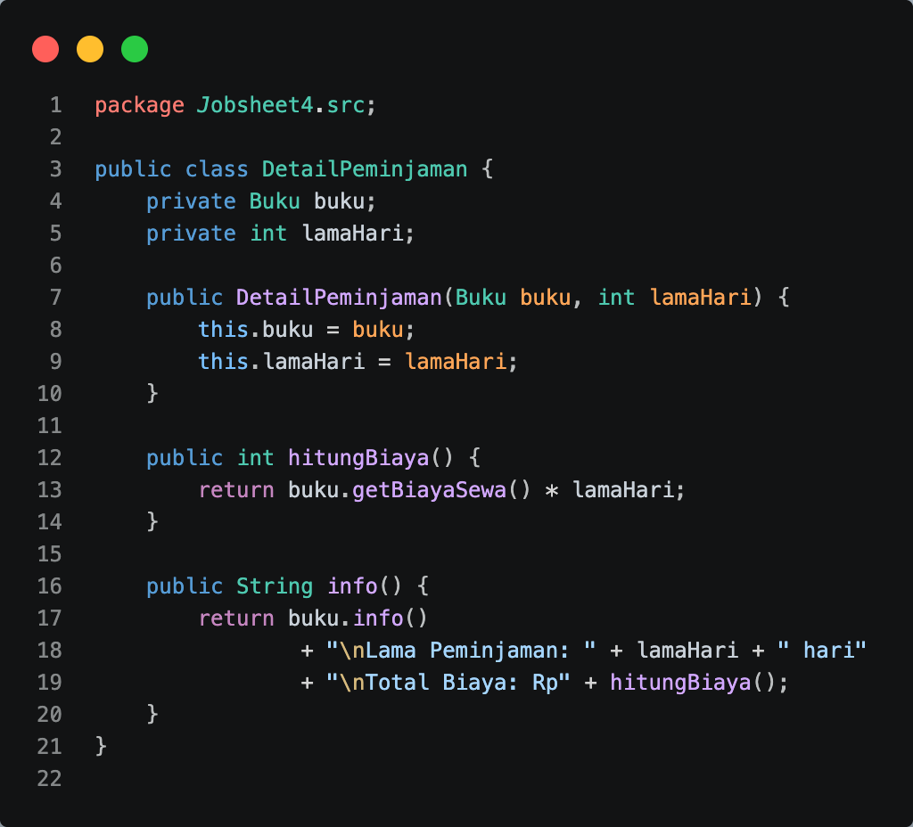

**Kelas Peminjaman**

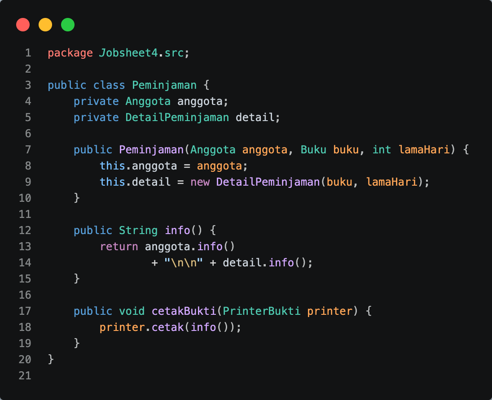

**Kelas PrinterBukti**

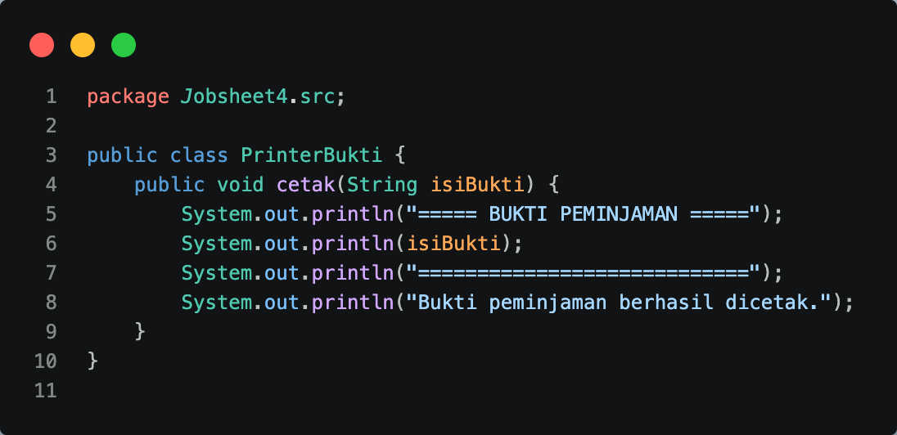

**Kelas MainTugasMandiri**

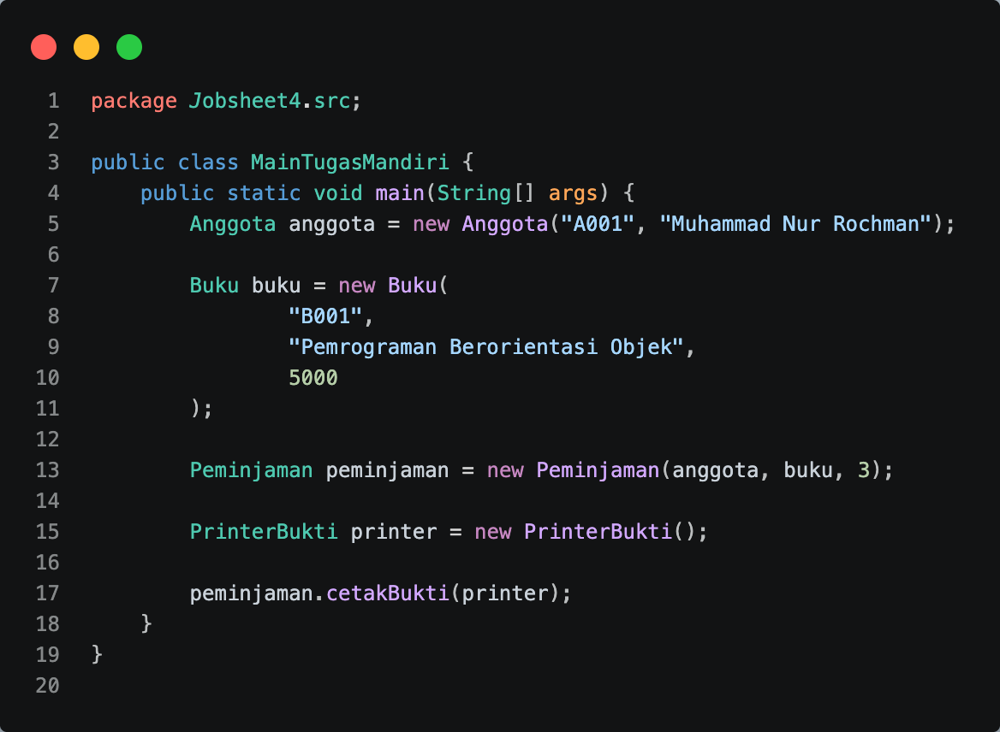

### Diagram Kelas

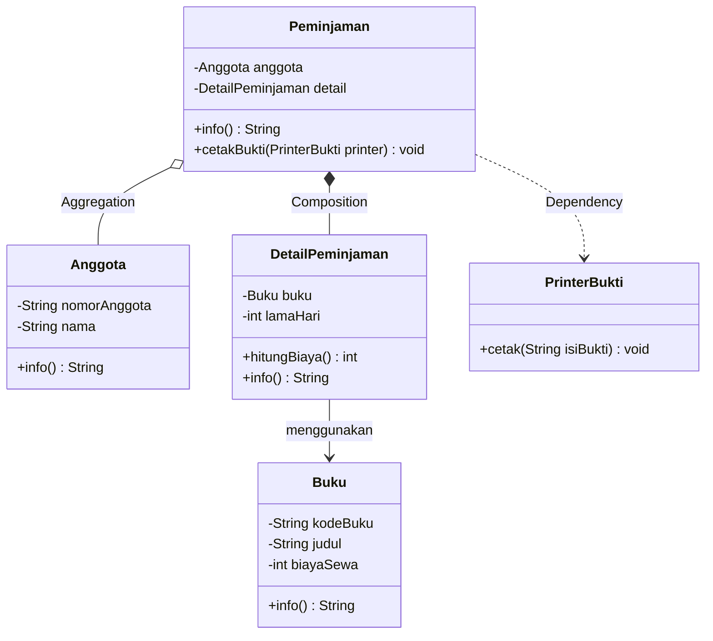
```mermaid
classDiagram
    class Anggota {
        -String nomorAnggota
        -String nama
        +info() String
    }
    class Buku {
        -String kodeBuku
        -String judul
        -int biayaSewa
        +info() String
    }
    class DetailPeminjaman {
        -Buku buku
        -int lamaHari
        +hitungBiaya() int
        +info() String
    }
    class Peminjaman {
        -Anggota anggota
        -DetailPeminjaman detail
        +info() String
        +cetakBukti(PrinterBukti printer) void
    }
    class PrinterBukti {
        +cetak(String isiBukti) void
    }
    Peminjaman o-- Anggota : Aggregation
    Peminjaman *-- DetailPeminjaman : Composition
    DetailPeminjaman --> Buku : menggunakan
    Peminjaman ..> PrinterBukti : Dependency
```

### Bukti Relasi Kelas

**1. Aggregation — Peminjaman dengan Anggota**

Relasi Aggregation ditunjukkan oleh atribut `private Anggota anggota;` pada kelas `Peminjaman`. Objek `Anggota` dibuat terlebih dahulu di kelas utama, lalu diberikan kepada constructor `Peminjaman` melalui parameter. Dengan demikian, objek anggota dapat dibuat dan tetap digunakan secara terpisah dari objek peminjaman.

**2. Composition — Peminjaman dengan DetailPeminjaman**

Relasi Composition ditunjukkan oleh atribut `private DetailPeminjaman detail;` dan kode `this.detail = new DetailPeminjaman(buku, lamaHari);` pada constructor `Peminjaman`. Objek `DetailPeminjaman` dibuat langsung di dalam kelas `Peminjaman` sebagai bagian dari data peminjaman.

**3. Dependency — Peminjaman dengan PrinterBukti**

Relasi Dependency ditunjukkan oleh method `cetakBukti(PrinterBukti printer)`. Objek `PrinterBukti` hanya digunakan sebagai parameter untuk mencetak bukti dan tidak disimpan sebagai atribut di kelas `Peminjaman`.

### Hasil Program

Dengan data anggota bernomor `A001`, nama `Muhammad Nur Rochman`, buku berjudul *Pemrograman Berorientasi Objek*, biaya sewa Rp5.000 per hari, dan lama peminjaman 3 hari, program menghasilkan total biaya sebesar Rp15.000.

Output program:

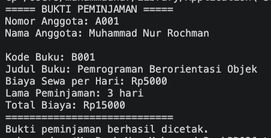

