# Laporan Praktikum PrakPBO

- **Nama:** Muhammad Nur Rochman
- **NIM:** 254107020121
- **Kelas:** TI-2G

---

## Percobaan 1: Overloading Method (Perkalian)

### Implementasi Program

**Kelas Perkalian**

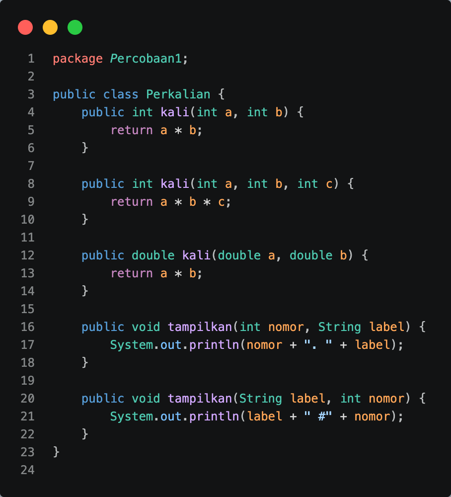

**Kelas MainPercobaan1**

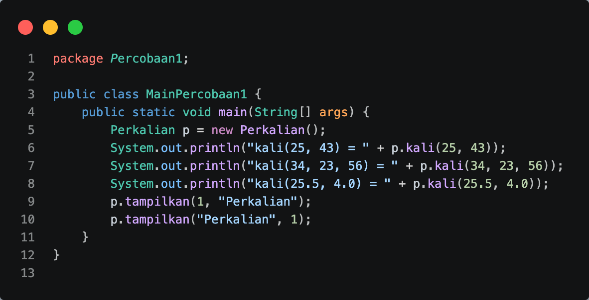

### Hasil Percobaan

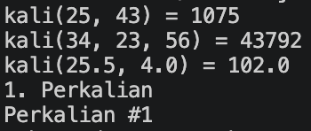

### Eksperimen

1. Menambahkan `public long kali(int a, int b)` menghasilkan error karena method `kali(int, int)` sudah didefinisikan.
2. Menambahkan `kali(int x, int y)` juga menghasilkan error karena nama parameter tidak membedakan signature method.
3. Pemanggilan `kali(5, 2.5)`, `kali(2, 3)`, dan `kali(2.0, 3)` menghasilkan `12.5`, `6`, dan `6.0`.

### Jawaban Singkat Percobaan 1

1. `kali(int, int)` dan `kali(int, int, int)` berbeda jumlah parameter; `kali(int, int)` dan `kali(double, double)` berbeda tipe; `tampilkan(int, String)` dan `tampilkan(String, int)` berbeda urutan tipe.
2. `kali(double, double)` dipanggil karena argumennya bertipe `double`, sehingga tidak perlu dikonversi menjadi `int`.
3. Urutan tipe parameter merupakan bagian dari signature. Tipe kembalian dan nama variabel parameter bukan pembeda overloading.
4. Nilai `int` dapat diperlebar menjadi `double`, sehingga pemanggilan tersebut cocok dengan `kali(double, double)`.

---

## Percobaan 2: Pemilihan Overload oleh Compiler (Resolusi)

### Implementasi Program

**Kelas Resolusi**

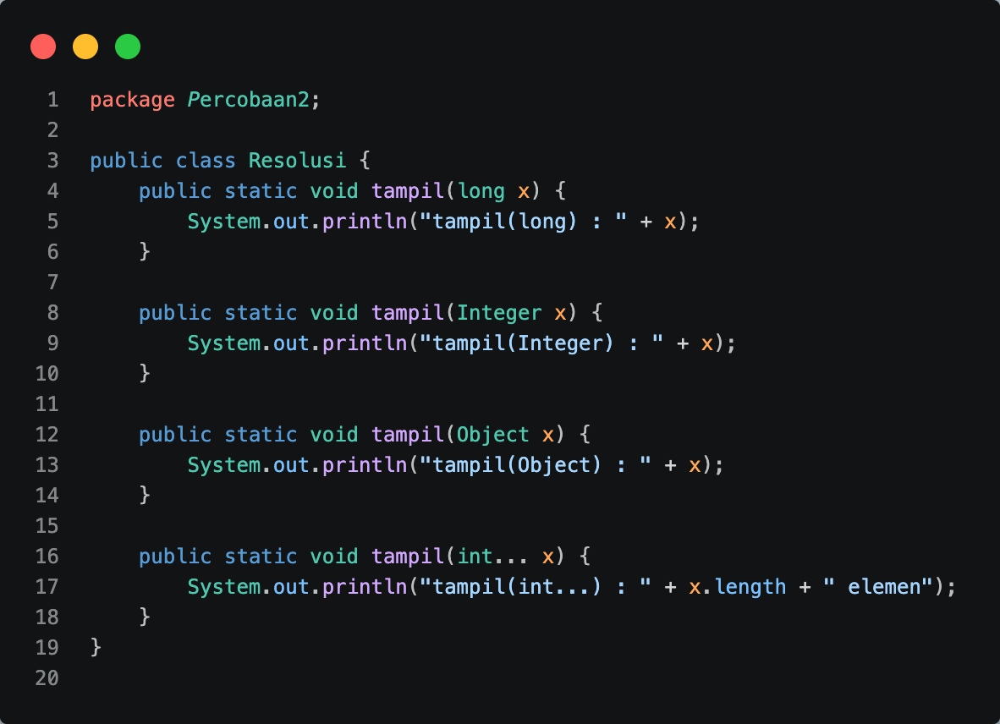

**Kelas MainPercobaan2**

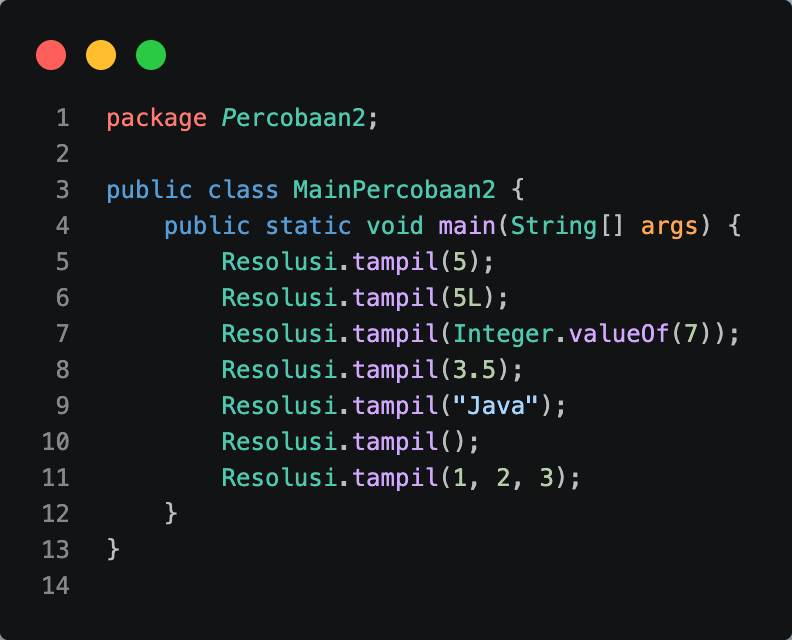

**Kelas Eksperimen2**

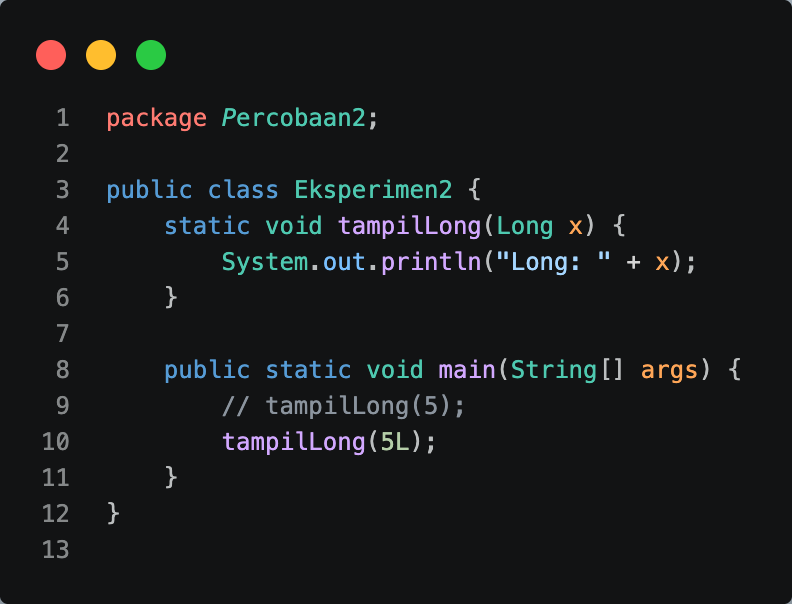

### Hasil Percobaan

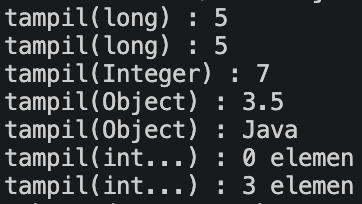

### Pengamatan Resolusi Overload

| Kondisi                                                             | Overload untuk `tampil(5)` |
| ------------------------------------------------------------------- | -------------------------- |
| Semua overload aktif                                                | `tampil(long)`             |
| `tampil(long)` dikomentari                                          | `tampil(Integer)`          |
| `tampil(long)` dan `tampil(Integer)` dikomentari                    | `tampil(Object)`           |
| `tampil(long)`, `tampil(Integer)`, dan `tampil(Object)` dikomentari | `tampil(int...)`           |

### Eksperimen

Pemanggilan `tampilLong(5)` menghasilkan error `incompatible types: int cannot be converted to Long`. Java tidak mengizinkan konversi widening lalu boxing dalam satu proses pemilihan overload.

### Jawaban Singkat Percobaan 2

1. `tampil(5)` memilih `tampil(long)` pada fase pertama karena widening diprioritaskan sebelum boxing.
2. Setelah `tampil(long)` dihapus, compiler memilih `Integer`. Setelah `Integer` dihapus, compiler memilih `Object`. Jika ketiganya tidak tersedia, compiler menggunakan varargs.
3. `tampilLong(5)` gagal karena konversi `int` ke `long` lalu ke `Long` tidak diizinkan. `tampil(5)` dapat memilih `Object` karena nilai dapat di-boxing menjadi `Integer`, lalu dianggap sebagai `Object`.
4. `Resolusi.tampil((short) 3)` memilih `tampil(long)` dan mencetak `tampil(long) : 3`. `Resolusi.tampil('A')` juga memilih `tampil(long)` dan mencetak nilai numerik karakter `65`.

---

## Percobaan 3: Overloading Konstruktor (Kucing)

### Implementasi Program

**Kelas Kucing**

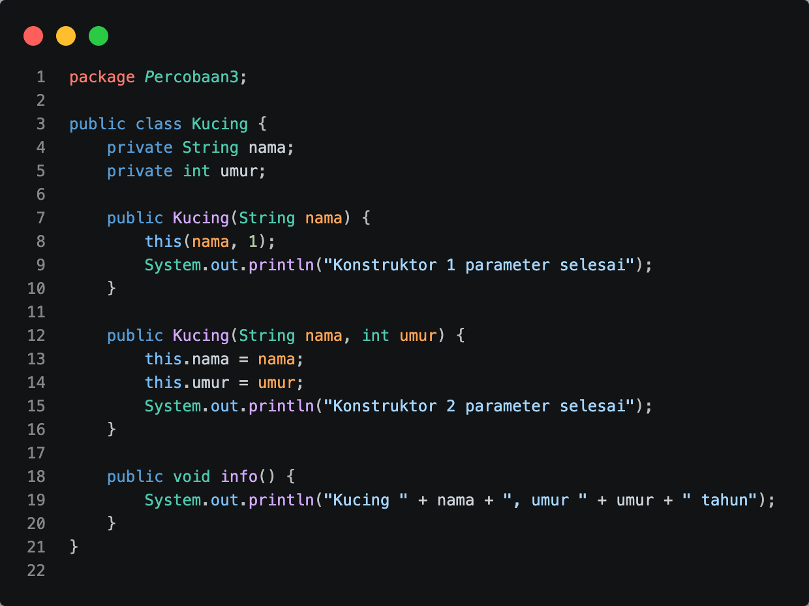

**Kelas MainPercobaan3**

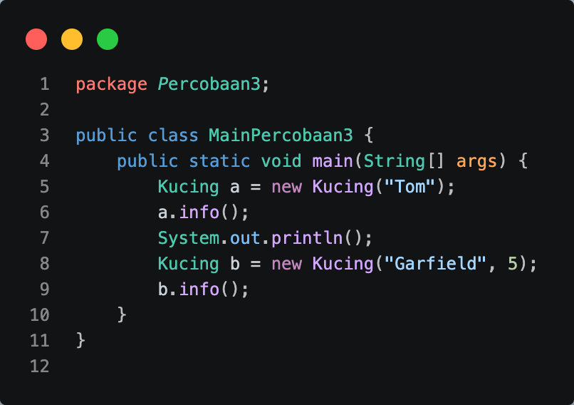

### Hasil Percobaan

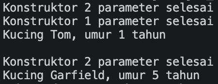

### Eksperimen

Pemanggilan `new Kucing()` menghasilkan error karena tidak tersedia konstruktor tanpa parameter. Setelah konstruktor buatan ditulis, Java tidak lagi menyediakan konstruktor default secara otomatis.

### Jawaban Singkat Percobaan 3

1. Konstruktor dua parameter dijalankan lebih dahulu karena dipanggil oleh `this(nama, 1)` dari konstruktor satu parameter.
2. `this(nama, 1)` menghindari penulisan ulang proses inisialisasi dan membuat kode lebih mudah dirawat.
3. Jika konstruktor tanpa parameter memanggil `this("Tanpa Nama")`, urutannya adalah konstruktor dua parameter, konstruktor satu parameter, lalu konstruktor nol parameter. Output tambahannya:
   ```text
   Konstruktor 2 parameter selesai
   Konstruktor 1 parameter selesai
   Konstruktor 0 parameter selesai
   ```

---

## Percobaan 4: Dasar Overriding (Ikan dan Piranha)

### Implementasi Program

**Kelas Ikan**

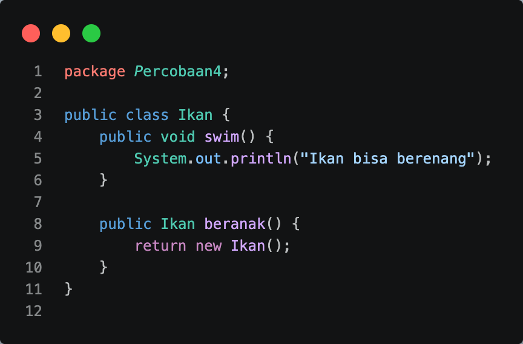

**Kelas Piranha**

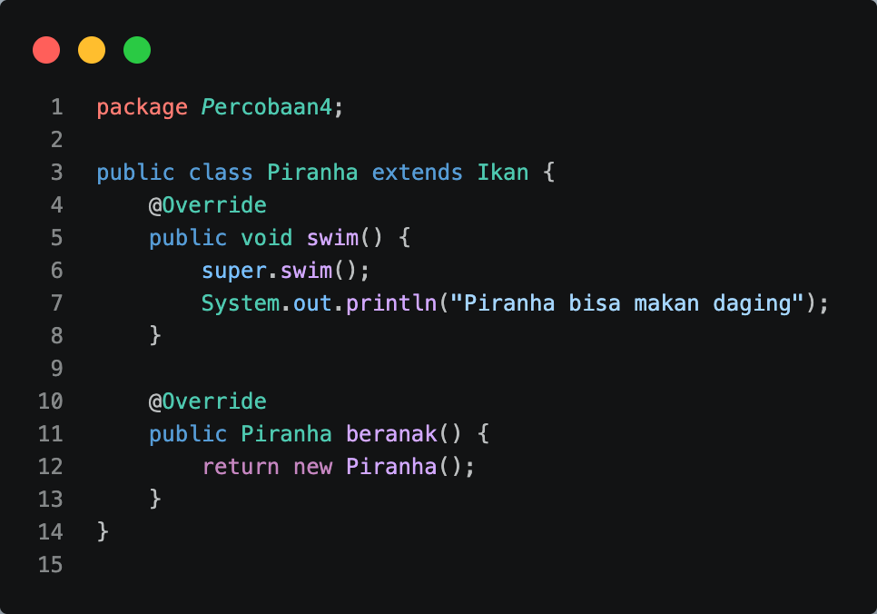

**Kelas MainPercobaan4**

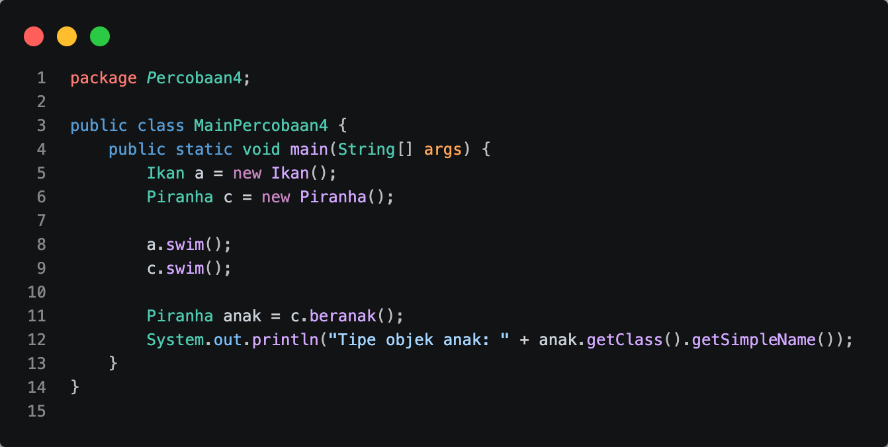

### Hasil Percobaan

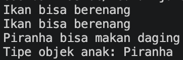

### Eksperimen Aturan Overriding

| Perubahan                                                           | Hasil                                                 |
| ------------------------------------------------------------------- | ----------------------------------------------------- |
| Menghapus `public` pada `Piranha.swim()`                            | Error: akses method lebih lemah daripada method induk |
| Membuat `Ikan.swim()` menjadi `final`                               | Error: method final tidak dapat di-override           |
| Mengubah menjadi `swim(int jarak)` tetapi tetap memakai `@Override` | Error: method tidak meng-override method induk        |
| Menambahkan `throws Exception` pada `Piranha.swim()`                | Error: checked exception baru tidak boleh ditambahkan |

### Jawaban Singkat Percobaan 4

1. `a.swim()` hanya menampilkan perilaku `Ikan`. `c.swim()` menjalankan method `Piranha` yang memanggil `super.swim()` terlebih dahulu. Jika `super.swim()` dihapus, teks `Ikan bisa berenang` tidak dicetak saat objeknya `Piranha`.
2. Covariant return memungkinkan `Piranha.beranak()` mengembalikan tipe `Piranha`. `Piranha anak = a.beranak()` tidak valid karena `a.beranak()` bertipe `Ikan`.
3. Menghapus `public` melanggar aturan akses; `final` melarang overriding; parameter berbeda membuat method tidak cocok dengan `@Override`; `throws Exception` melanggar aturan checked exception.
4. Jika `@Override` dihapus, `swim(int)` menjadi overload baru, bukan overriding. Pemanggilan `c.swim()` tetap menggunakan method tanpa parameter.
5. Jika `Ikan.swim()` dibuat `private`, method itu tidak diwariskan untuk di-override. Deklarasi `@Override` pada `Piranha.swim()` akan menghasilkan error karena tidak ada method induk yang sesuai untuk di-override.

---

## Percobaan 5: Overloading dan Overriding Bersama (Karyawan, Staff, Manager)

### Implementasi Program

**Kelas Karyawan**

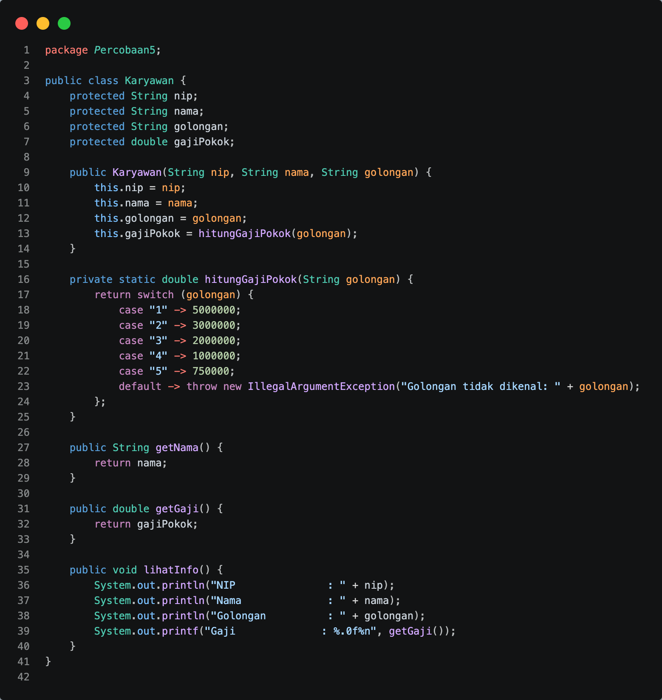

**Kelas Staff**

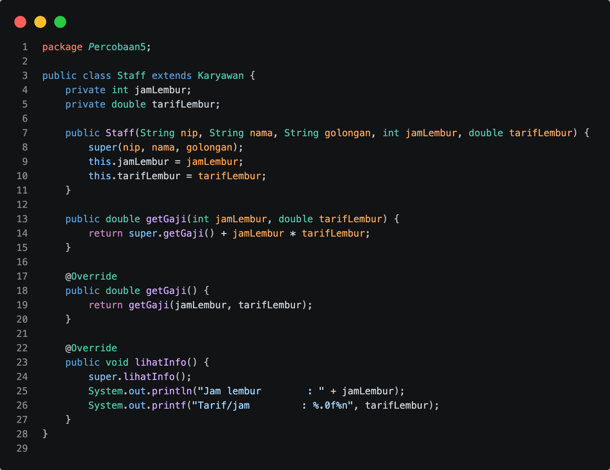

**Kelas Manager**

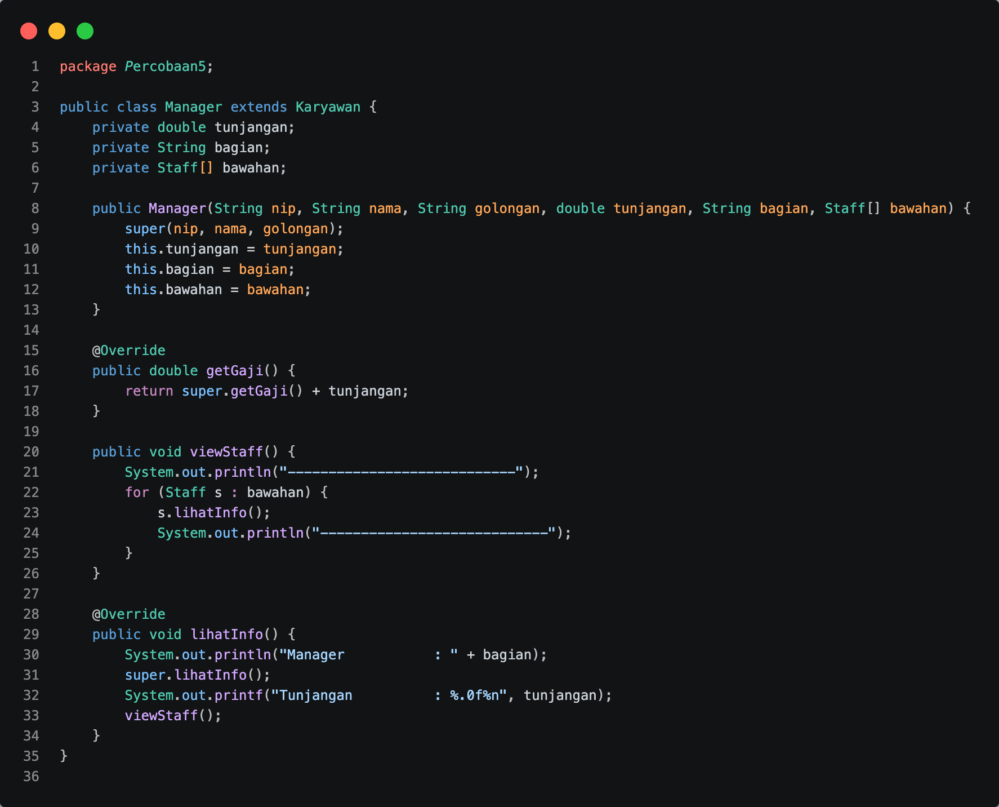

**Kelas MainPercobaan5**

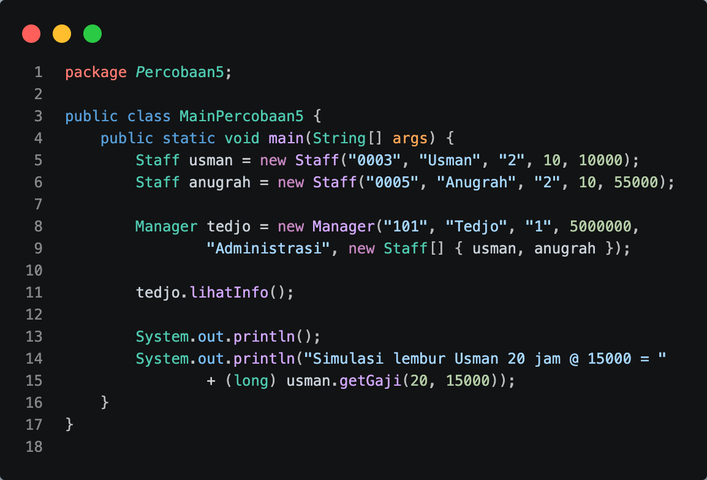

### Hasil Percobaan

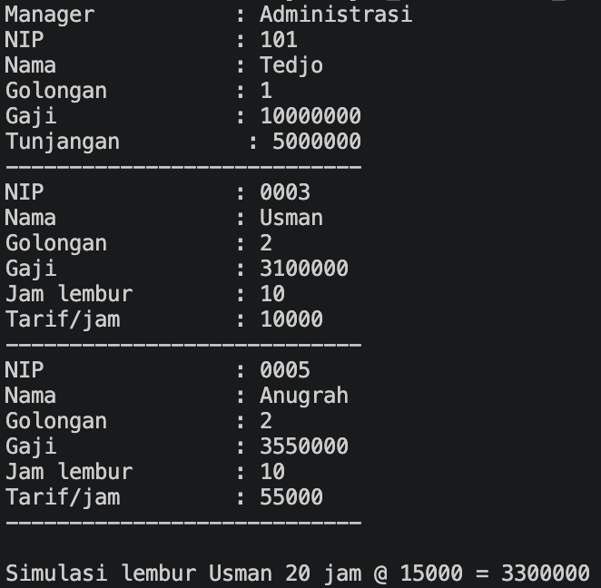

### Jawaban Singkat Percobaan 5

1. Overloading terdapat pada `Staff.getGaji(int, double)`, sedangkan overriding terdapat pada `Staff.getGaji()`, `Staff.lihatInfo()`, `Manager.getGaji()`, dan `Manager.lihatInfo()`. Overloading membedakan parameter; overriding menggunakan signature yang sama dengan method induk.
2. `super.getGaji()` mengambil gaji pokok dari `Karyawan`. `getGaji(jamLembur, tarifLembur)` memanggil method overload untuk menghitung gaji beserta lembur. Jika method overload memanggil `getGaji()` tanpa parameter, terjadi rekursi berulang hingga `StackOverflowError`.
3. Jika `Staff.getGaji()` hanya mengembalikan hasil lembur, gaji Staff tidak lagi mencakup gaji pokok. Gaji Manager tidak berubah karena perhitungannya menggunakan `super.getGaji()` milik `Karyawan` ditambah tunjangan.
4. Hubungan `Manager` dengan `Karyawan` adalah _is-a_ karena `Manager extends Karyawan`. Hubungan `Manager` dengan `Staff` adalah _has-a_ melalui atribut `Staff[] bawahan`.

---

## Tugas Mandiri 1: Overloading pada Kelas Segitiga

### Implementasi Program

**Kelas Segitiga**

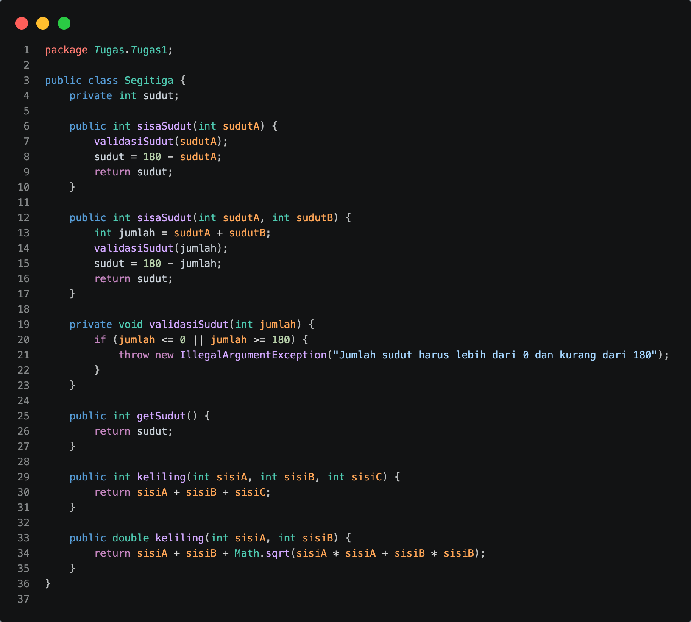

**Kelas MainTugas1**

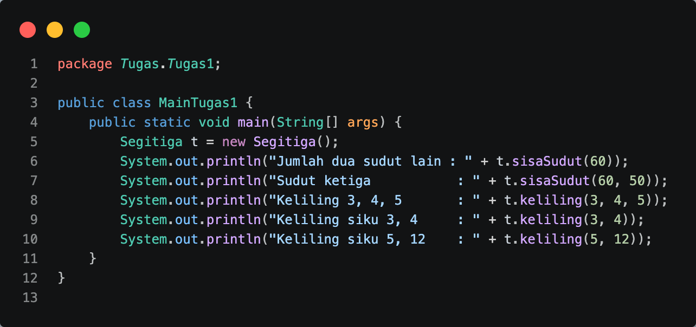

### Hasil Program

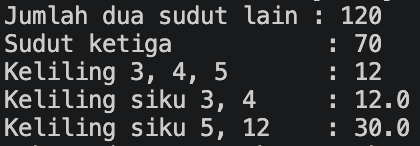

### Jawaban Analisis

1. Method tersebut sah sebagai overloading karena jumlah dan tipe parameter berbeda, bukan karena tipe kembalian berbeda.
2. `t.keliling(3, 4.0)` menghasilkan error karena tidak ada overload yang menerima parameter `(int, double)`.

---

## Tugas Mandiri 2: Overriding pada Manusia, Dosen, dan Mahasiswa

### Implementasi Program

**Kelas Manusia**

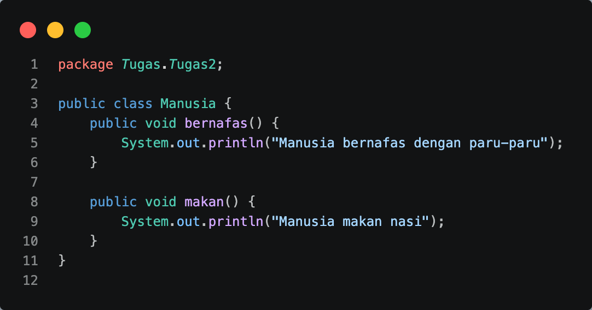

**Kelas Dosen**

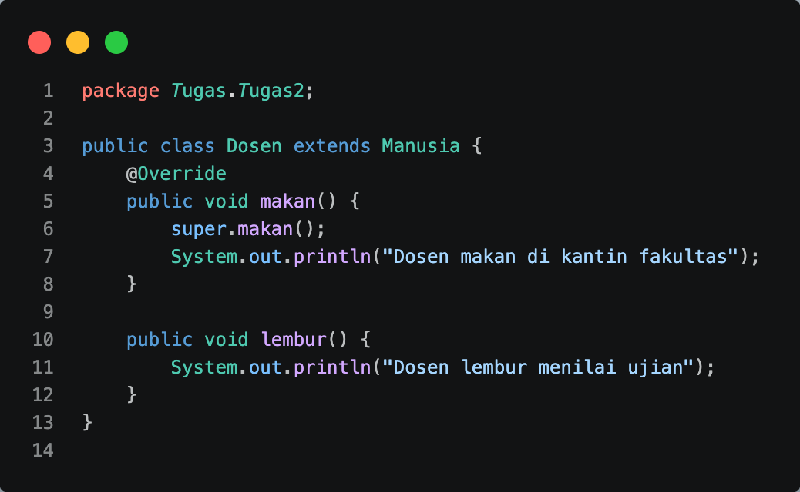

**Kelas Mahasiswa**

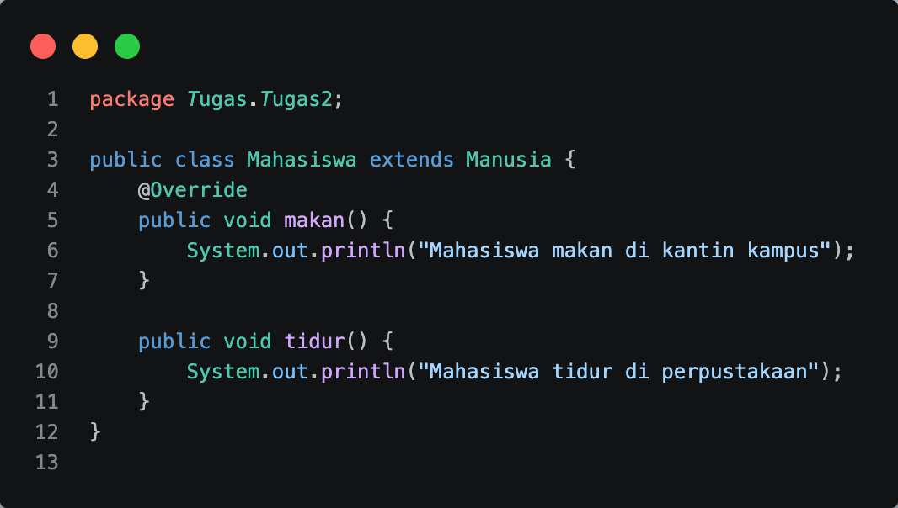

**Kelas MainTugas2**

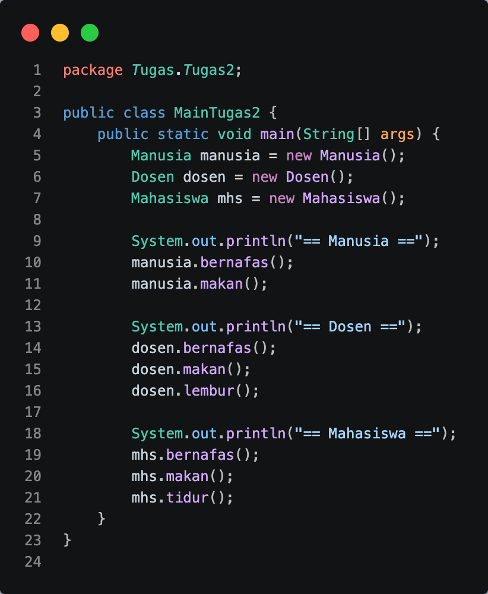

### Hasil Program

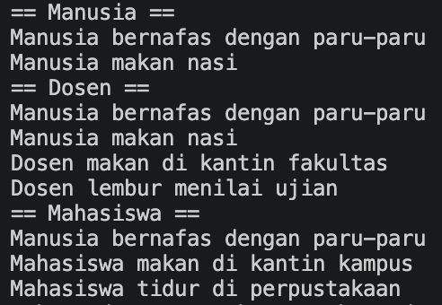

### Jawaban Analisis

1. `bernafas()` pada `Mahasiswa` menggunakan method warisan dari `Manusia` karena tidak di-override. `makan()` menampilkan teks berbeda karena di-override oleh `Mahasiswa`.
2. Method `Dosen.makan()` memanggil `super.makan()` sehingga teks dari `Manusia` tampil lebih dahulu, kemudian teks khusus Dosen. `Mahasiswa.makan()` tidak memanggil `super.makan()`, sehingga hanya teks khusus Mahasiswa yang tampil.

---

## Tugas Mandiri 3: Perbandingan Overloading dan Overriding

| Aspek                 | Overloading                                   | Overriding                                               |
| --------------------- | --------------------------------------------- | -------------------------------------------------------- |
| Lokasi terjadi        | Dalam satu kelas atau pada hubungan pewarisan | Pada subclass terhadap method superclass                 |
| Signature (parameter) | Nama sama, parameter berbeda                  | Nama dan parameter sama                                  |
| Tipe kembalian        | Boleh berbeda, tetapi bukan pembeda utama     | Sama atau covariant                                      |
| Access modifier       | Tidak harus sama                              | Tidak boleh lebih terbatas dari method induk             |
| Peran `@Override`     | Tidak digunakan untuk menandai overload       | Memastikan method benar-benar meng-override method induk |

Overloading dipilih ketika nama method sama digunakan untuk jenis parameter berbeda, misalnya `Perkalian.kali(int, int)` dan `Perkalian.kali(int, int, int)`. Overriding dipilih ketika subclass perlu memberi perilaku khusus, misalnya `Piranha.swim()`.

Method `static` tidak di-override secara polimorfik karena method tersebut terkait dengan kelas. Method `private` tidak diwariskan sehingga tidak dapat di-override. Method `final` tidak dapat di-override karena implementasinya dikunci oleh kelas induk.

---